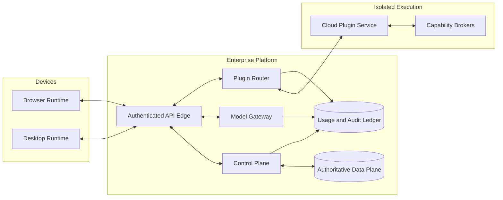
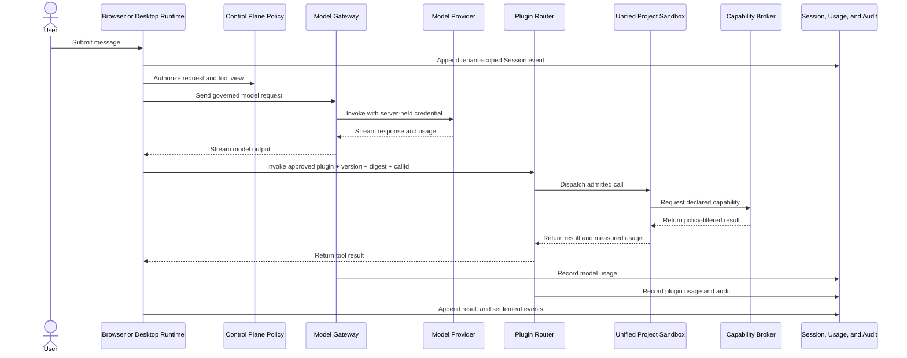

# Enterprise Agent Platform Blueprint

English | [中文](enterprise-agent-platform.zh.md)

## Summary

This proposal turns DeepSeek Harness into an enterprise Agent platform without moving every Agent into a shared backend. Browser and desktop runtimes keep Agent execution and automation close to the user, a cloud plugin service handles short, server-side capability calls, and one control plane governs identity, policy, models, plugins, usage, billing, and audit across all three locations. The first commercial release targets an enterprise beta delivered both as multi-tenant SaaS and as a customer-operated private deployment.

The proposal uses the current Cordis composition model, Agent loop, tool pipeline, Session log, Remote gateway, SDK, and dynamic-package experiments as foundations. It does not claim that the repository already provides tenant identity, enterprise authorization, durable plugin publication, cloud isolation, or commercial metering. The [owning Agent Note](../../../.agents/notes/proposed/architecture/2026-09-05-enterprise-agent-platform.md) records why this allocation was selected and what it gives up.

## Table of Contents

- [Proposal status](#proposal-status)
- [Commercial position](#commercial-position)
- [Current foundation](#current-foundation)
- [Target product architecture](#target-product-architecture)
- [Enterprise governance and security](#enterprise-governance-and-security)
- [Unified plugin platform](#unified-plugin-platform)
- [Cloud execution and brokered capabilities](#cloud-execution-and-brokered-capabilities)
- [Commercial model](#commercial-model)
- [Proposed domain protocols](#proposed-domain-protocols)
- [Delivery stages and acceptance](#delivery-stages-and-acceptance)
- [Risks and deliberate limits](#risks-and-deliberate-limits)
- [Further Exploration](#further-exploration)
- [Dev Note](#dev-note)

-----

<a id="proposal-status"></a>
## Proposal status

This page is a product and technical blueprint for founders, product leaders, security owners, and platform engineers. It describes a target system, not shipped behavior or a compatibility promise. Each implementation stage requires its own API, storage, security, migration, and operational decisions before code ships.

The enterprise beta has five required outcomes: a user can sign in to an organization, run an Agent and long-running automation from a browser or managed desktop runtime, consume a centrally governed model, install an approved private plugin, and invoke that plugin through a cloud service when the task needs a server-side capability while administrators can attribute policy decisions and cost. Public marketplace settlement, offline operation, and arbitrary plugin images are outside that first acceptance point.

-----

<a id="commercial-position"></a>
## Commercial position

The product sells governance and reliable execution rather than a chat page alone. Employees get one Agent experience across browser and desktop clients. Administrators get identity, permissions, budgets, data controls, approved plugins, and audit. Plugin developers get a local development path, controlled cloud capabilities, immutable releases, and an enterprise distribution channel. Finance and security teams get attributable usage and review evidence instead of unmanaged model keys and scripts.

The organizing rule is **Agent execution stays near the user; shared governance and on-demand plugin calls use the platform**. Local files, Git repositories, shells, native applications, scheduled automation, webhook-triggered automation, and long-running work remain on managed user devices. Browser-native work remains in the browser. The cloud provides short-lived plugin calls and capability brokers when a task needs a service-side operation. Identity, policy, model access, release approval, metering, and audit remain centralized in both SaaS and private deployments.

The repository uses the [MIT License](../../../LICENSE), which permits use, modification, distribution, sublicensing, and sale when its copyright and permission notice accompanies copies or substantial portions. Productization must also preserve the obligations disclosed in [THIRD_PARTY_NOTICES.md](../../../THIRD_PARTY_NOTICES.md), review the licenses of newly introduced runtime images and build dependencies, and complete counsel review for trademarks, privacy, export controls, customer terms, and marketplace agreements. This page is an engineering and product proposal, not legal advice.

-----

<a id="current-foundation"></a>
## Current foundation

DeepSeek Harness already supplies several reusable mechanisms. The [architecture](../../architecture.md) composes the product as reversible Cordis plugins; the [Agent loop](../../../packages/core/agent-loop/README.md) and [tool pipeline](../../tool-execution-pipeline.md) own request and tool execution; the [Session subsystem](../../subsystems/session.md) owns an append-only model-visible event log; the [Typert gateway](../../../packages/api/gateway/README.md) carries typed Client-to-Host calls and streams; and the [SDK group](../../../packages/sdk/README.md) exposes supported external clients. These mechanisms are useful inside each future runtime, but none is an enterprise control plane by itself.

The current browser product still depends on a Node Host. The [Web application bundle](../../../packages/bundle/web-app/README.md) uses a process-token and cookie flow to authenticate Host APIs for that local application, while the lower-level [Web server](../../../packages/host/webserver/README.md) deliberately owns no server-wide TLS, authentication, or origin policy. The shipped identity is a [Harness-home-scoped anonymous identifier](../../../packages/identity/anonymous-user-id/README.md), not an account, organization, or service principal. Default [settings](../../../packages/settings/settings-file/README.md), [credentials](../../../packages/credentials/credentials-local/README.md), and [Session persistence](../../../packages/session/session-persistence-jsonl/README.md) are local files rather than tenant-managed cloud data.

The [experimental WebWorker runtime](../../../packages/experimental/webworker-runtime/README.md) proves that a complete plugin tree can run inside a browser worker, but it is a private preview surface. It uses a virtual filesystem, plaintext Session logs, browser substitutes for processes, a reduced shell with no Git or network commands, and structural stubs for native Node facilities. It provides packaging and compatibility evidence, not the supported Browser Runtime described here.

The [dynamic Cordis host runner](../../../packages/extensions/cordis-host-runner/README.md) proves immutable in-memory package versions and reversible activation. Its `node:vm` isolation is explicitly a cooperative development boundary, its registry is process-local and non-durable, and a package may reach the live Host services granted to it. A commercial cloud plugin service must retain the useful lifecycle model while replacing the trust, durability, routing, and isolation model.

The [E2B integration](../../../packages/e2b/e2b/README.md) demonstrates that filesystem and subprocess capability providers can move execution into a remote sandbox without changing their consumers. The enterprise design generalizes that provider pattern, but does not require E2B as the sole SaaS or private-deployment implementation.

-----

<a id="target-product-architecture"></a>
## Target product architecture

The target has three execution runtimes and two cloud planes. Each runtime hosts an Agent loop and only the tools permitted at that location. The control plane makes organizational decisions; the data plane persists enterprise records and application state. SaaS deploys those planes as multi-tenant services, while the private distribution deploys the same logical services and protocols in the customer's environment.

| Component | Primary responsibility | Required trust rule |
|---|---|---|
| Browser Runtime | Chat, research, SaaS APIs, browser tools, and browser plugins | Web Worker isolation limits accidental interference; enterprise policy still treats plugin code as untrusted |
| Desktop Runtime | Local files, Git, Shell, Python, LSP, and native integrations | Device policy and explicit grants restrict local authority; cloud policy cannot imply OS isolation |
| Cloud Plugin Service | Short-lived, on-demand plugin calls and capability brokers | Every immutable plugin version uses the project's unified sandbox with external tenant and resource policy |
| Control Plane | Identity, organizations, policy, model gateway, marketplace, quotas, billing, and audit | Every decision is tenant-scoped, attributable, and fail-closed |
| Data Plane | Session events, plugin releases, usage ledger, audit records, and customer-managed data | SaaS isolates tenants; private deployment keeps authoritative records in the customer environment |



Browser and desktop clients are online-first. They cache enough state for responsive rendering and recovery from a transient connection loss, but the enterprise service is authoritative for Session events. The SaaS service stores tenant-isolated events; a private deployment stores them inside the customer environment. Offline mutation and later conflict reconciliation are not part of the enterprise beta.

The model gateway is the only component that holds platform-managed provider credentials. It resolves the tenant's provider and policy, removes disallowed request fields, enforces budgets and rate limits, records measured model usage, and streams the response to the runtime that owns the Agent loop. A bring-your-own-provider configuration binds a tenant Secret at the gateway and never returns its plaintext value to a browser. The cloud plugin service is invoked on demand by a client-owned Agent automation; it does not own the automation schedule, Agent loop, or long-running workflow.



-----

<a id="enterprise-governance-and-security"></a>
## Enterprise governance and security

An organization is the tenant and top-level policy owner. Teams group people and resources within it. Human users authenticate through OIDC or SAML; SCIM provisions and deprovisions membership. Service accounts use separately revocable credentials and cannot inherit an interactive browser session. Every request carries an opaque tenant, actor, and runtime identity that the API edge binds from authentication rather than accepting from a request body.

| Role | Default authority |
|---|---|
| Organization Owner | Subscription, deployment ownership, administrator assignment, and organization deletion |
| Administrator | Members, teams, runtimes, policies, quotas, and private marketplace configuration |
| Security Reviewer | Plugin permission review, AI finding resolution, release approval or rejection, revocation, and audit export |
| Plugin Publisher | Source submission and release-candidate management without self-approval |
| Finance Auditor | Usage, allocation, invoices, budgets, and exports without content access by default |
| Member | Approved Agents, models, plugins, and data within assigned team policy |

Authorization combines role permissions with tenant, team, resource, runtime, and plugin policy. A publisher cannot approve the same release. A finance auditor sees cost dimensions but not prompts, files, plugin inputs, or results unless another role grants content access. Emergency suspension can disable a user, runtime, provider, plugin version, or tenant without deleting its audit record.

The platform defines retention, deletion, export, legal hold, region, and encryption policy independently for Session content, audit records, usage records, plugin source, build artifacts, and plugin-owned data. SaaS encrypts data in transit and at rest with tenant-scoped key management where the storage service supports it. Private deployment exposes the same settings but assigns infrastructure, backup, key custody, and network perimeter responsibility to the customer; the deployment guide must make that responsibility matrix explicit.

Security enforcement stays outside untrusted plugin code. A Browser Runtime uses a Worker and a narrow message protocol. A Desktop Runtime uses OS and product policy, explicit local capability grants, and process isolation appropriate to the platform. The Cloud Plugin Service uses the project's unified sandbox adapter, read-only code, resource controls, a capability broker, and an egress proxy for short calls. Cordis fibers provide deterministic registration and disposal inside those environments; they are lifecycle management, not a security boundary.

Every security-relevant action writes an immutable audit record with tenant, actor, action, target, decision, policy revision, time, request trace, and outcome. Audit records cover authentication, membership, policy changes, Secret binding, model selection, plugin submission and approval, runtime registration, plugin invocation, capability access, quota enforcement, export, and administrative suspension. Content fields use an explicit redaction policy rather than being copied into audit by default.

-----

<a id="unified-plugin-platform"></a>
## Unified plugin platform

One plugin identity may publish immutable versions for `browser`, `desktop`, and `cloud`. A version may target one or more locations, but each target has its own artifact and declared entrypoint. The release binds all target artifacts to one reviewed manifest so the tool schema shown to the model cannot drift from the code routed for execution.

The manifest declares the following categories without embedding platform credentials:

| Category | Required declaration |
|---|---|
| Identity | Opaque plugin id, semantic version, publisher, tenant visibility, and source revision |
| Artifacts | Target runtime, entrypoint, runtime version, artifact digest, and manifest digest |
| Agent contribution | Tool schemas, prompt contributions, presentation metadata, and compatibility range |
| Dependencies | Lockfile digest, package ecosystems, native dependency flag, and SBOM reference |
| Permissions | Object storage, database, Secret bindings, queue topics, network domains, and local capabilities |
| Resources | CPU, memory, execution deadline, concurrency, storage, and payload limits |
| Reliability | Idempotency classification, retry policy, reentrancy declaration, and health check |
| Commercial policy | Free, enterprise purchase, or metered use plus billable dimensions |

Publishing follows one fixed chain:

1. The developer tests source locally with the same manifest and target runtime versions used by the platform builders.
2. The publisher submits source, lockfiles, manifest, tests, and requested permissions; a developer-supplied binary is never independently trusted.
3. A platform-controlled build resolves dependencies through approved proxies, scans the submission, runs tests, and produces signed immutable artifacts and an SBOM.
4. Automated policy rejects prohibited licenses, known vulnerability thresholds, embedded Secrets, unapproved native code, undeclared network access, and manifest/artifact mismatches.
5. An AI review scans source and dependency diffs, permission changes, requested Secrets, domains, data access, resource ceilings, vulnerabilities, and pricing, then produces explainable findings and a risk classification. An enterprise Security Reviewer resolves the findings and approves or rejects the exact digests; AI review never grants approval by itself.
6. The release service signs the approved record, deploys a canary pool, observes health, and makes the version eligible for routing.

Approval binds tenant, plugin id, version, artifact digest, manifest digest, permission digest, reviewer, and decision time. Any code, dependency, tool schema, permission, network, Secret, resource, or pricing change creates a new version and requires a new approval. Revocation prevents new calls immediately and drains or terminates existing calls according to the severity recorded by the reviewer.

Private enterprise plugins need enterprise approval. A public marketplace plugin first needs platform review and then each consuming enterprise's approval under its own policy. Public discovery, platform review, paid settlement, refunds, publisher payout, and configurable revenue share arrive after the private enterprise beta; the underlying release and approval records are shared so that public distribution does not introduce another executable format.

Browser plugins execute as JavaScript in a dedicated Web Worker and communicate through a structured, validated host protocol. Desktop plugins execute in the managed DSH runtime with explicit local permissions and remain inappropriate for code from an untrusted public publisher until the desktop sandbox policy is implemented. Cloud plugins use platform-provided, version-pinned Node.js or Python build and runtime images. The beta does not accept publisher-provided arbitrary OCI images.

-----

<a id="cloud-execution-and-brokered-capabilities"></a>
## Cloud execution and brokered capabilities

Dependency installation occurs only in an isolated build stage. Controlled npm and PyPI proxies enforce package policy and preserve retrieved inputs. Builders require lockfiles, pin the base image by digest, scan licenses, vulnerabilities, embedded credentials, and native extensions, then sign the artifact and SBOM. Runtime sandboxes mount code read-only, have no package-manager credentials, and cannot run `npm install` or `pip install`.

Each immutable `pluginId + version + digest` is executed through the project's unified sandbox adapter. The cloud service may keep a small warm pool for high-volume calls, but it does not own automation state or long-running work. Deployment preloads a candidate, runs its health check, admits a bounded canary, and atomically moves new calls after the canary satisfies policy. The router keeps each call pinned to its approved digest, then releases idle capacity. Rollback changes the routing pointer to a previously approved digest; it never mutates an artifact in place.

One sandbox instance processes one call at a time by default. A plugin may request instance-level concurrency only when its manifest declares reentrancy and review approves the higher limit. Admission control applies hierarchical limits for user, team, tenant, plugin version, worker pool, model provider, database connection, and external API. Queues are bounded; an expired deadline or saturated limit returns a classified refusal rather than waiting without limit.

Delivery is at least once. Every invocation carries `callId`, idempotency key, deadline, attempt, and trace id. The router may automatically retry only a call whose approved reliability declaration and capability operations are idempotent for that key. A side-effecting call without proved idempotency settles as failed or indeterminate and requires caller or administrator action; it is never retried blindly.

Cloud plugins receive default-deny capabilities through brokers enforced outside the sandbox:

| Capability | Broker behavior |
|---|---|
| Object storage | Tenant/plugin namespace, quotas, encryption, lifecycle, content scanning, and audited operations |
| Plugin KV/SQL | Plugin-owned schema, migrations at release time, transaction and size limits, and tenant partitioning |
| Enterprise Data Connector | Named connection, read/write policy, schema/table scope, row and byte limits, query timeout, connection concurrency, and query audit |
| Secret binding | Vault/KMS-backed reference resolved for one approved operation without returning the stored plaintext through control APIs |
| Network egress | Domain, method, port, byte, and deadline allowlist enforced by a proxy with DNS rebinding protection and audit |
| Queue and events | Declared topics, bounded payloads, delivery policy, dead-letter handling, and tenant ownership |
| Observability | Structured logs, metrics, traces, progress, redaction, retention, and tenant-visible correlation |

Existing enterprise databases are accessed through named connectors, not raw credentials mounted in plugin files. Connector policy constrains operation class and data scope before the downstream driver runs. Query time, returned rows, bytes, and concurrent connections are capped outside the plugin, and every operation is attributable to tenant, actor, plugin version, and call.

-----

<a id="commercial-model"></a>
## Commercial model

SaaS pricing combines an organization subscription, active seats, and metered usage. The subscription funds governance, support, and included capacity. Usage records model tokens, cloud plugin CPU and memory time, storage, database connector operations, network egress, and separately priced advanced services. Customer-facing credits are a configurable budget and consumption display; the financial ledger retains original resource quantities, supplier cost, currency, price rule, tax treatment, and billed amount.

Private deployment uses an annual platform license and support plan. The customer pays its infrastructure and model providers directly unless a separate resale agreement applies. The product still records internal usage and cost allocation so departments can budget, charge back, and detect abuse without requiring the vendor to invoice every operation.

Marketplace products may be free, enterprise-purchased, or metered per invocation or resource dimension. Commission, minimum price, payout schedule, refund policy, and tax handling are versioned commercial configuration rather than constants in plugin code. A plugin's executable approval is separate from a purchase entitlement: payment never grants a permission that enterprise policy rejected.

The finance model tracks these equations by tenant, plan, runtime, model, and plugin:

```text
recognized revenue = seat revenue + usage revenue + marketplace revenue + private-deployment revenue
gross margin = recognized revenue - model cost - compute cost - storage cost - egress cost - payment cost - attributable support cost
unit contribution = billed usage - attributable variable cost
```

Budgets can apply to organization, team, user, model, plugin, and billing period. Soft thresholds notify finance and administrators; hard thresholds reject new work before cost is incurred. A provider or plugin circuit breaker stops a dimension when measured cost, error rate, latency, or policy failures exceed its configured threshold. Every charge carries the same tenant, actor, Session, plugin/model, and trace identities used by the audit record, while finance views redact content.

-----

<a id="proposed-domain-protocols"></a>
## Proposed domain protocols

The platform needs language-independent protocols before it needs shared TypeScript classes. The following records are proposed integration subjects, not public APIs added by this document. Cross-process identifiers are opaque and never inferred from names or filesystem paths.

| Protocol | Required information | Primary invariant |
|---|---|---|
| Runtime registration and heartbeat | Tenant, actor/device, runtime kind, runtime version, capability declaration, health, policy digest, and lease expiry | The server binds identity from authentication and expires a runtime whose lease is not renewed |
| Plugin release manifest | Plugin id, version, target artifacts and digests, tool schemas, dependencies, permissions, Secrets, egress, resources, reliability, and pricing | Routing, schemas, permissions, and approval resolve the same immutable digests |
| Plugin invocation envelope | Tenant, actor, Session, plugin id, version, digest, `callId`, idempotency key, deadline, attempt, trace id, and JSON input | A call never floats to a newer version and duplicate attempts retain one logical call identity |
| Capability request | Call identity, capability kind, named binding, requested operation, limits, and arguments | The broker re-authorizes the operation outside the sandbox against the approved permission digest |
| Metering event | Tenant, actor, Session, provider/plugin, resource dimensions, supplier cost, price rule, amount, idempotency key, and measurement interval | Ledger ingestion is idempotent and preserves original quantities independently of display credits |
| Approval record | Tenant, plugin, version, artifact/manifest/permission digests, reviewer, decision, time, conditions, and revocation | A changed digest cannot inherit an earlier approval |

Each protocol owner must later define wire encoding, validation, branded in-process identifiers, authorization, storage schema, compatibility, retries, and deletion policy in the same change that implements it. Agent-loop or Session-event changes must update both SDK projections and the required recorded-session coverage under repository policy.

-----

<a id="delivery-stages-and-acceptance"></a>
## Delivery stages and acceptance

Delivery uses capability gates rather than calendar promises. SaaS and private deployment advance through the same gates; an environment-specific adapter may differ, but it cannot omit authorization, audit, metering, or release verification.

| Stage | Required delivery | Exit evidence |
|---|---|---|
| Platform foundation | Tenant identity, authenticated API edge, policy service, model gateway, authoritative Session persistence, audit/usage ledger, and Runtime registration | One governed request can run from each client type with tenant isolation, cost attribution, revocation, and recovery evidence |
| Enterprise beta | SaaS and private distributions, Browser and Desktop Runtimes with client-owned automation, private plugin submission with AI and human review, short-call Cloud Plugin Service, capability brokers, quotas, and billing export | One enterprise can complete the five proposal outcomes with failure isolation and a reproducible audit trail |
| Commercial expansion | Public marketplace review, entitlements, settlement and payout, regional deployment, advanced compliance, and fleet operations | Cross-enterprise distribution cannot bypass enterprise approval, data region, budget, or executable-digest pinning |

Product measures include organization activation, weekly active seats, successful Agent turns, approved plugin adoption, plugin publish lead time, and administrator policy completion. Reliability measures include model and plugin success rates, queue delay, p95 execution latency, sandbox cold-start rate, failure containment, recovery time, and audit completeness. Commercial measures include model and compute cost per successful turn, usage revenue, unit contribution, gross margin, support cost, and budget rejection rate.

Distributable Runtime packaging, Apple signing and notarization, and clean-machine installation checks are a final release gate after the three product stages above. They do not block development or enterprise-beta integration, but the product cannot claim customer-ready installation until that gate passes.

The enterprise beta is accepted only when a failure or revocation in one tenant, plugin version, or sandbox cannot route new work into another tenant or unapproved version; model and plugin usage reconcile to the financial ledger; Session history reconstructs what reached the model; and administrators can export the policy and audit evidence for a selected request without receiving unrelated tenant content.

-----

<a id="risks-and-deliberate-limits"></a>
## Risks and deliberate limits

| Risk | Required mitigation | Deliberate beta limit |
|---|---|---|
| Browser capability gaps | Define a browser-safe capability catalog, detect unsupported plugins before activation, and keep native work on Desktop | No claim of Bash, Git, native processes, or Node compatibility in Browser Runtime |
| Plugin supply chain compromise | Controlled builds, lockfiles, SBOM, signatures, AI findings, human approval, revocation, and digest-pinned routing | No arbitrary publisher OCI images and no runtime dependency installation |
| Sandbox escape or noisy neighbor | The project's unified sandbox adapter, external capability enforcement, resource quotas, and rapid suspension | Cordis and `node:vm` never count as tenant isolation |
| SaaS/private version drift | One protocol conformance suite, shared release artifacts, environment adapters, and explicit responsibility matrix | No private-deployment-only protocol fork |
| Sensitive Session content | Tenant isolation, encryption, retention, regional placement, redaction, least-privilege export, and customer-hosted private data plane | No offline-first replica or automatic conflict merge |
| Unbounded model or plugin cost | Pre-admission budget checks, measured usage, hierarchical limits, circuit breakers, and reconciliation | No unlimited plan whose provider cost is unmeasured |
| Database overreach | Named connectors, scoped operations, query limits, read-only defaults, and complete access audit | No raw production database credential inside a plugin sandbox |
| Marketplace governance failure | Separate technical approval and commercial entitlement, platform plus enterprise review, dispute records, and kill switches | Public paid distribution follows the private-plugin beta |

The design knowingly depends on control-plane availability. A transient connection may be retried, but the beta does not let a client continue policy-sensitive work from a stale offline policy. The design also accepts higher platform complexity to deliver SaaS and private deployment together; shared protocols and conformance tests are required to keep that choice supportable.

-----

<a id="further-exploration"></a>
## Further Exploration

- [DeepSeek Harness architecture](../../architecture.md) — current composition, Agent loop, Session log, and capability model.
- [API gateway](../../api-gateway.md) — current browser-to-Host API assembly and trust model.
- [Experimental WebWorker runtime](../../../packages/experimental/webworker-runtime/README.md) — browser-hosted preview evidence and its explicit limits.
- [Dynamic Cordis host runner](../../../packages/extensions/cordis-host-runner/README.md) — current immutable in-memory packages and lifecycle behavior.
- [Enterprise platform Agent Note](../../../.agents/notes/proposed/architecture/2026-09-05-enterprise-agent-platform.md) — decision rationale, alternatives, acceptance criteria, and risks.

-----

<a id="dev-note"></a>
## Dev Note

None.
