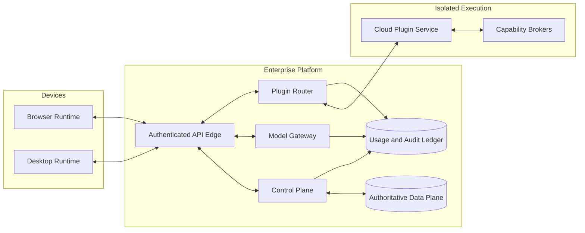
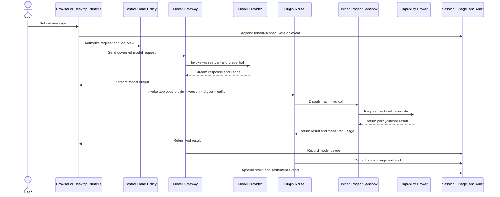

# 企业 Agent 平台蓝图

[English](enterprise-agent-platform.md) | 中文

## 概要

本提案将 DeepSeek Harness 改造为企业 agent（智能体）平台，但不会把每个 agent 都迁入共享后端。浏览器和桌面运行时在用户侧执行 agent 和自动化任务，云端插件服务按需处理短时的服务端能力调用，统一控制平面则治理三类位置的身份、策略、模型、插件、用量、计费和审计。首个商业版本面向企业内测，并同时提供多租户 SaaS 和客户自行运营的私有化部署。

本提案以现有的 Cordis 组合模型、agent loop（智能体循环）、工具流水线、会话日志、Remote 网关、SDK 和动态包实验为基础，但不声称仓库已经具备租户身份、企业授权、持久化插件发布、云端隔离或商业计量能力。[对应的 Agent Note](../../../.agents/notes/proposed/architecture/2026-09-05-enterprise-agent-platform.zh.md)记录了选择这一职责分配的理由和相应代价。

## 目录

- [提案状态](#proposal-status)
- [商业定位](#commercial-position)
- [当前基础](#current-foundation)
- [目标产品架构](#target-product-architecture)
- [企业治理与安全](#enterprise-governance-and-security)
- [统一插件平台](#unified-plugin-platform)
- [云端执行与能力代理](#cloud-execution-and-brokered-capabilities)
- [商业模型](#commercial-model)
- [提议的领域协议](#proposed-domain-protocols)
- [交付阶段与验收](#delivery-stages-and-acceptance)
- [风险与明确限制](#risks-and-deliberate-limits)
- [延伸阅读](#further-exploration)
- [开发备注](#dev-note)

-----

<a id="proposal-status"></a>
## 提案状态

本文是面向创始人、产品负责人、安全负责人和平台工程师的产品与技术蓝图。它描述目标系统，不代表已交付行为或兼容性承诺。每个实施阶段仍须在代码交付前通过独立决策确定 API、存储、安全、迁移和运维方案。

企业内测必须实现五项结果：用户可以登录组织，可以从浏览器或受管桌面运行时运行 agent 和长时间自动化，可以使用集中治理的模型，可以安装已批准的企业私有插件，还可以在任务需要服务端能力时通过云端服务调用该插件，同时管理员能够追溯策略决策和成本。公共市场结算、离线运行和任意插件镜像不属于第一个验收点。

-----

<a id="commercial-position"></a>
## 商业定位

产品出售的是治理能力和可靠执行，而不只是聊天页面。员工可在浏览器和桌面客户端获得一致的 agent 体验。管理员获得身份、权限、预算、数据控制、获批插件和审计能力。插件开发者获得本地开发路径、受控云端能力、不可变发布版本和企业分发渠道。财务与安全团队获得可归属的用量和审核证据，而不是无法治理的模型密钥和脚本。

总体规则是：**agent 执行靠近用户，共享治理和按需插件调用使用平台**。本地文件、Git 仓库、Shell、原生应用、定时自动化、Webhook 触发的自动化和长时间工作都留在受管用户设备上。浏览器原生工作留在浏览器中。云端只在任务需要服务端操作时提供短时插件调用和能力代理。身份、策略、模型访问、版本审批、计量和审计在 SaaS 与私有化部署中都保持集中管理。

仓库采用 [MIT License](../../../LICENSE)，只要副本或软件主要部分保留版权与许可声明，就允许使用、修改、分发、再许可和销售。产品化还必须履行 [THIRD_PARTY_NOTICES.md](../../../THIRD_PARTY_NOTICES.md) 披露的义务，审核新增运行时镜像和构建依赖的许可证，并就商标、隐私、出口管制、客户条款和市场协议完成法律顾问审查。本文是工程与产品提案，不构成法律意见。

-----

<a id="current-foundation"></a>
## 当前基础

DeepSeek Harness 已经提供多项可复用机制。[架构文档](../../architecture.zh.md)说明产品如何由可逆的 Cordis 插件组合；[Agent loop](../../../packages/core/agent-loop/README.zh.md)和[工具流水线](../../tool-execution-pipeline.zh.md)负责请求与工具执行；[会话子系统](../../subsystems/session.zh.md)拥有追加式的模型可见事件日志；[Typert 网关](../../../packages/api/gateway/README.zh.md)承载类型化的 Client 到 Host 调用与流；[SDK 包组](../../../packages/sdk/README.zh.md)提供受支持的外部客户端。这些机制可用于未来各类运行时，但都不能单独充当企业控制平面。

当前浏览器产品仍依赖 Node Host。[Web 应用 bundle](../../../packages/bundle/web-app/README.zh.md)使用进程令牌和 Cookie 流程为该本地应用的 Host API 提供认证，而底层 [Web 服务器](../../../packages/host/webserver/README.zh.md)明确不负责服务器级 TLS、认证或来源策略。已交付的身份是[作用于 Harness 主目录的匿名标识符](../../../packages/identity/anonymous-user-id/README.zh.md)，并非账号、组织或服务主体。默认的[设置](../../../packages/settings/settings-file/README.zh.md)、[凭据](../../../packages/credentials/credentials-local/README.zh.md)和[会话持久化](../../../packages/session/session-persistence-jsonl/README.zh.md)使用本地文件，并非租户管理的云端数据。

[实验性 WebWorker 运行时](../../../packages/experimental/webworker-runtime/README.zh.md)证明完整插件树可以在浏览器 Worker 中运行，但它是私有预览功能。它使用虚拟文件系统、明文会话日志、浏览器进程替代实现、没有 Git 或网络命令的精简 Shell，并为原生 Node 功能提供结构性存根。它提供打包和兼容性证据，不是本文描述的受支持 Browser Runtime。

[动态 Cordis Host Runner](../../../packages/extensions/cordis-host-runner/README.zh.md)证明了内存中不可变包版本和可逆激活机制。其 `node:vm` 隔离明确属于协作式开发边界，注册表仅存在于进程内且不持久化，插件包还可以访问获准的实时 Host Service。商业云插件服务应保留有用的生命周期模型，同时替换其信任、持久化、路由和隔离模型。

[E2B 集成](../../../packages/e2b/e2b/README.zh.md)证明文件系统和子进程能力的 Service Provider 可以在不改变 Consumer 的情况下把执行迁移到远端沙箱。企业设计将推广这种 Provider 模式，但不要求 E2B 成为 SaaS 或私有化部署的唯一实现。

-----

<a id="target-product-architecture"></a>
## 目标产品架构

目标系统包含三类执行运行时和两个云端平面。每个运行时托管一个 agent loop，并且只开放该位置允许使用的工具。控制平面负责组织级决策，数据平面持久化企业记录和应用状态。SaaS 将这些平面部署为多租户服务，私有化发行版则在客户环境中部署相同的逻辑服务和协议。

| 组件 | 主要职责 | 必须遵守的信任规则 |
|---|---|---|
| Browser Runtime | 聊天、研究、SaaS API、浏览器工具和浏览器插件 | Web Worker 隔离可限制意外干扰；企业策略仍将插件代码视为不可信代码 |
| Desktop Runtime | 本地文件、Git、Shell、Python、LSP 和原生集成 | 设备策略和显式授权限制本地权限；云端策略不能代表操作系统隔离 |
| Cloud Plugin Service | 短时按需插件调用和能力代理 | 每个不可变插件版本使用项目统一沙箱，并由外部机制执行租户和资源策略 |
| Control Plane | 身份、组织、策略、模型网关、插件市场、配额、计费和审计 | 每项决策都必须限定租户、可追溯且默认拒绝 |
| Data Plane | 会话事件、插件版本、用量账本、审计记录和客户管理的数据 | SaaS 隔离租户；私有化部署把权威记录保存在客户环境中 |



浏览器和桌面客户端都采用在线优先模式。它们缓存足以实现快速渲染和短暂断线恢复的状态，但企业服务是会话事件的权威来源。SaaS 服务存储租户隔离的事件，私有化部署则将事件存储在客户环境内。离线修改和后续冲突协调不属于企业内测范围。

模型网关是唯一持有平台管理的模型提供商凭据的组件。它解析租户提供商与策略，移除不允许的请求字段，执行预算和速率限制，记录实测模型用量，并把响应流式传回拥有 agent loop 的运行时。自带提供商配置在网关处绑定租户 Secret，绝不向浏览器返回其明文值。云端插件服务由客户端拥有的 agent 自动化按需调用；它不负责自动化调度、agent loop 或长时间工作流。



-----

<a id="enterprise-governance-and-security"></a>
## 企业治理与安全

组织是租户和最高层策略所有者。团队在组织内对人员和资源分组。人类用户通过 OIDC 或 SAML 认证，SCIM 负责配置和移除成员。服务账号使用可以单独撤销的凭据，不能继承交互式浏览器会话。每个请求都携带不透明的租户、操作者和运行时身份，API 边缘层从认证信息中绑定这些身份，而不接受请求正文自行声明的身份。

| 角色 | 默认权限 |
|---|---|
| Organization Owner | 订阅、部署所有权、管理员任命和组织删除 |
| Administrator | 成员、团队、运行时、策略、配额和企业私有市场配置 |
| Security Reviewer | 插件权限审核、处理 AI 发现结果、版本批准或拒绝、撤销和审计导出 |
| Plugin Publisher | 提交源码和管理候选版本，但不能自我批准 |
| Finance Auditor | 查看用量、成本分配、账单、预算和导出，默认不能访问内容 |
| Member | 在所属团队策略范围内使用获批的 agent、模型、插件和数据 |

授权把角色权限与租户、团队、资源、运行时和插件策略结合起来。发布者不能批准自己的同一版本。Finance Auditor 可以查看成本维度，但默认不能看到提示词、文件、插件输入或结果，除非另一个角色授予内容访问权限。紧急暂停可以禁用用户、运行时、提供商、插件版本或租户，同时保留对应审计记录。

平台分别为会话内容、审计记录、用量记录、插件源码、构建制品和插件自有数据定义保留、删除、导出、法律保全、地域和加密策略。SaaS 对传输中和静态数据加密，并在存储服务支持时使用租户级密钥管理。私有化部署提供相同设置，但把基础设施、备份、密钥托管和网络边界责任交给客户；部署指南必须明确列出责任矩阵。

安全强制机制位于不可信插件代码之外。Browser Runtime 使用 Worker 和精简消息协议。Desktop Runtime 使用操作系统与产品策略、显式本地能力授权，以及适合对应平台的进程隔离。Cloud Plugin Service 使用项目统一的沙箱适配器、只读代码、资源控制、能力代理和出站代理处理短时调用。Cordis fiber 在这些环境内提供确定性的注册和资源释放；它们用于生命周期管理，并非安全边界。

每个与安全相关的动作都会写入不可变审计记录，内容包括租户、操作者、动作、目标、决策、策略修订、时间、请求追踪和结果。审计记录覆盖认证、成员关系、策略变更、Secret 绑定、模型选择、插件提交与审批、运行时注册、插件调用、能力访问、配额执行、导出和管理暂停。审计默认不复制内容字段，而是对其应用明确的脱敏策略。

-----

<a id="unified-plugin-platform"></a>
## 统一插件平台

一个插件身份可以为 `browser`、`desktop` 和 `cloud` 发布不可变版本。某个版本可以面向一个或多个位置，但每个目标都有自己的制品和已声明入口点。该版本把所有目标制品绑定到同一份已审核 manifest（元数据清单），使展示给模型的工具 schema 不会偏离实际路由执行的代码。

Manifest 声明下列信息，但不嵌入平台凭据：

| 类别 | 必填声明 |
|---|---|
| 身份 | 不透明插件 ID、语义版本、发布者、租户可见性和源码修订 |
| 制品 | 目标运行时、入口点、运行时版本、制品摘要和 manifest 摘要 |
| Agent 扩展 | 工具 schema、提示词扩展、展示元数据和兼容版本范围 |
| 依赖 | 锁文件摘要、包生态、原生依赖标记和 SBOM 引用 |
| 权限 | 对象存储、数据库、Secret 绑定、队列主题、网络域名和本地能力 |
| 资源 | CPU、内存、执行期限、并发、存储和载荷限制 |
| 可靠性 | 幂等分类、重试策略、可重入声明和健康检查 |
| 商业策略 | 免费、企业购买或计量使用，以及计费维度 |

发布遵循一条固定流程：

1. 开发者使用与平台构建器相同的 manifest 和目标运行时版本在本地测试源码。
2. 发布者提交源码、锁文件、manifest、测试和所需权限；平台绝不单独信任开发者提供的二进制文件。
3. 由平台控制的构建过程通过获批代理解析依赖、扫描提交内容、运行测试，并生成签名的不可变制品和 SBOM。
4. 自动化策略拒绝禁用许可证、超过阈值的已知漏洞、嵌入的 Secret、未经批准的原生代码、未声明的网络访问，以及 manifest 与制品不匹配。
5. AI 审核扫描源码和依赖差异、权限变化、所需 Secret、域名、数据访问、资源上限、漏洞和定价，并生成可解释的发现结果和风险分类。企业 Security Reviewer 处理这些发现并批准或拒绝精确摘要；AI 审核本身不能授予批准。
6. 发布服务签署已批准记录，部署灰度池并观察健康状态，随后允许该版本接受路由。

审批绑定租户、插件 ID、版本、制品摘要、manifest 摘要、权限摘要、审核者和决策时间。代码、依赖、工具 schema、权限、网络、Secret、资源或定价的任何变化都会创建新版本并要求重新审批。撤销会立即阻止新调用，并根据审核者记录的严重程度排空或终止已有调用。

企业私有插件需要企业审批。公共市场插件先接受平台审核，再根据每个使用企业的策略分别获得批准。公共发现、平台审核、付费结算、退款、发布者付款和可配置分成在企业私有插件内测之后交付；底层发布与审批记录保持共用，使公共分发不会引入另一种可执行格式。

浏览器插件以 JavaScript 运行在专用 Web Worker 中，并通过结构化且经过验证的 Host 协议通信。桌面插件在受管 DSH 运行时内以显式本地权限执行；在桌面沙箱策略完成前，它不适合运行不可信公共发布者的代码。云端插件使用平台提供并锁定版本的 Node.js 或 Python 构建与运行镜像。内测阶段不接受发布者提供的任意 OCI 镜像。

-----

<a id="cloud-execution-and-brokered-capabilities"></a>
## 云端执行与能力代理

依赖安装只发生在隔离的构建阶段。受控 npm 和 PyPI 代理执行包策略并保留获取的输入。构建器要求锁文件，按摘要固定基础镜像，扫描许可证、漏洞、嵌入式凭据和原生扩展，然后签署制品和 SBOM。运行时沙箱以只读方式挂载代码，不持有包管理器凭据，也不能执行 `npm install` 或 `pip install`。

每个不可变的 `pluginId + version + digest` 都通过项目统一的沙箱适配器执行。云端服务可以为高流量调用保留少量热实例池，但不拥有自动化状态或长时间工作。部署过程预加载候选版本、执行健康检查、接收有限灰度流量，并在灰度满足策略后以原子方式迁移新调用。路由器把每次调用固定到已批准的摘要，然后释放空闲容量。回滚只把路由指针切换到先前已批准的摘要，绝不原地修改制品。

默认情况下，一个沙箱实例一次只处理一个调用。只有插件 manifest 声明可重入性且审核批准更高限制时，才可以申请实例内并发。准入控制对用户、团队、租户、插件版本、Worker 池、模型提供商、数据库连接和外部 API 实施分层限制。队列有明确上限；超过期限或达到饱和限制时返回分类拒绝，而不是无限等待。

系统采用至少一次投递。每次调用携带 `callId`、幂等键、期限、尝试次数和追踪 ID。只有当获批的可靠性声明及能力操作对该幂等键均满足幂等要求时，路由器才可以自动重试。无法证明幂等性的副作用调用会以失败或不确定状态结束，并要求调用方或管理员处理；系统绝不盲目重试。

云端插件通过沙箱外强制执行的代理获得默认拒绝能力：

| 能力 | 代理行为 |
|---|---|
| 对象存储 | 租户/插件命名空间、配额、加密、生命周期、内容扫描和操作审计 |
| 插件 KV/SQL | 插件自有 schema、发布时迁移、事务和大小限制以及租户分区 |
| 企业数据连接器 | 命名连接、读写策略、schema/表范围、行数和字节限制、查询超时、连接并发与查询审计 |
| Secret 绑定 | 由 Vault/KMS 支持的引用，只为一次获批操作解析，控制 API 不返回存储的明文 |
| 网络出口 | 由代理执行域名、方法、端口、字节和期限白名单，并提供 DNS 重绑定防护和审计 |
| 队列与事件 | 声明的主题、有限载荷、投递策略、死信处理和租户所有权 |
| 可观测性 | 结构化日志、指标、追踪、进度、脱敏、保留策略和租户可见关联 |

现有企业数据库通过命名连接器访问，不把原始凭据挂载到插件文件。连接器策略在下游驱动执行前限制操作类型和数据范围。插件外部机制限制查询时间、返回行数、字节数和并发连接，并将每次操作归属到租户、操作者、插件版本和调用。

-----

<a id="commercial-model"></a>
## 商业模型

SaaS 定价由组织订阅、活跃席位和计量用量组成。订阅费用覆盖治理、支持和包含容量。用量记录模型 Token、云插件 CPU 与内存时间、存储、数据库连接器操作、网络出口和单独定价的高级服务。面向客户的积分是可配置的预算和消费展示方式；财务账本保留原始资源数量、供应商成本、币种、价格规则、税务处理和计费金额。

私有化部署采用年度平台许可和支持计划。除非另有转售协议，客户直接支付其基础设施和模型提供商费用。产品仍记录内部用量和成本分配，使各部门能够制定预算、内部结算并检测滥用，而无需供应商对每项操作开具账单。

市场产品可以免费、由企业购买，或按调用及资源维度计量。佣金、最低价格、付款周期、退款策略和税务处理属于带版本的商业配置，而不是插件代码中的常量。插件的可执行审批与购买权益彼此独立：付款绝不授予企业策略已拒绝的权限。

财务模型按租户、套餐、运行时、模型和插件追踪以下公式：

```text
recognized revenue = seat revenue + usage revenue + marketplace revenue + private-deployment revenue
gross margin = recognized revenue - model cost - compute cost - storage cost - egress cost - payment cost - attributable support cost
unit contribution = billed usage - attributable variable cost
```

预算可以作用于组织、团队、用户、模型、插件和计费周期。软阈值通知财务人员和管理员；硬阈值在成本产生前拒绝新任务。当实测成本、错误率、延迟或策略失败超过配置阈值时，提供商或插件熔断器停止对应维度。每笔费用携带与审计记录相同的租户、操作者、会话、插件/模型和追踪身份，财务视图则对内容脱敏。

-----

<a id="proposed-domain-protocols"></a>
## 提议的领域协议

平台首先需要语言无关协议，而不是共享 TypeScript 类。下列记录是提议的集成主题，并非本文新增的公共 API。跨进程标识都是不透明值，绝不能从名称或文件系统路径推断。

| 协议 | 必需信息 | 主要不变量 |
|---|---|---|
| 运行时注册与心跳 | 租户、操作者/设备、运行时类型、运行时版本、能力声明、健康状态、策略摘要和租约到期时间 | 服务端从认证信息绑定身份，并让未续租的运行时到期 |
| 插件发布 manifest | 插件 ID、版本、目标制品与摘要、工具 schema、依赖、权限、Secret、网络出口、资源、可靠性和定价 | 路由、schema、权限和审批必须解析到同一组不可变摘要 |
| 插件调用信封 | 租户、操作者、会话、插件 ID、版本、摘要、`callId`、幂等键、期限、尝试次数、追踪 ID 和 JSON 输入 | 调用绝不漂移到较新版本，重复尝试保留同一个逻辑调用身份 |
| 能力请求 | 调用身份、能力类型、命名绑定、请求操作、限制和参数 | 代理根据已批准的权限摘要，在沙箱外重新授权操作 |
| 计量事件 | 租户、操作者、会话、提供商/插件、资源维度、供应商成本、价格规则、金额、幂等键和计量区间 | 账本写入满足幂等要求，并独立于展示积分保留原始数量 |
| 审批记录 | 租户、插件、版本、制品/manifest/权限摘要、审核者、决策、时间、条件和撤销状态 | 发生变化的摘要不能继承较早的审批 |

每个协议的所有者必须在实现协议的同一变更中定义线路编码、验证、进程内品牌化标识符、授权、存储 schema、兼容性、重试和删除策略。Agent loop 或会话事件的变化必须按照仓库策略同步更新两个 SDK 投影和所需的录制会话覆盖。

-----

<a id="delivery-stages-and-acceptance"></a>
## 交付阶段与验收

交付采用能力门槛，而不承诺日历时间。SaaS 和私有化部署通过相同门槛；特定环境的适配器可以不同，但不能省略授权、审计、计量或版本验证。

| 阶段 | 必须交付 | 退出证据 |
|---|---|---|
| 平台基础 | 租户身份、认证 API 边缘层、策略服务、模型网关、权威会话持久化、审计/用量账本和运行时注册 | 每类客户端都能执行一次受治理请求，并提供租户隔离、成本归属、撤销和恢复证据 |
| 企业内测 | SaaS 与私有化发行版、带客户端自动化的 Browser 和 Desktop Runtime、带 AI 与人类审核的企业私有插件提交、短时 Cloud Plugin Service、能力代理、配额和账单导出 | 一个企业可以完成提案的五项目标，并获得故障隔离和可复现审计轨迹 |
| 商业扩展 | 公共市场审核、权益、结算与付款、区域部署、高级合规和运行时群组运营 | 跨企业分发无法绕过企业审批、数据地域、预算或可执行摘要固定规则 |

产品指标包括组织激活、每周活跃席位、成功 agent 轮次、获批插件采用率、插件发布时间和管理员策略完成率。可靠性指标包括模型与插件成功率、队列延迟、p95 执行延迟、沙箱冷启动率、故障控制范围、恢复时间和审计完整性。商业指标包括每次成功轮次的模型与计算成本、用量收入、单位贡献、毛利、支持成本和预算拒绝率。

可分发 Runtime 打包、Apple 签名与公证以及干净机器安装检查属于上述三个产品阶段之后的最终发布门槛。这些工作不会阻塞开发或企业内测集成，但在门槛通过前不能声称产品可交付客户安装。

只有满足以下条件才算企业内测验收通过：一个租户、插件版本或沙箱中的故障或撤销不会把新任务路由到另一个租户或未获批版本；模型和插件用量可以与财务账本核对；会话历史可以重建模型收到的内容；管理员可以导出指定请求的策略与审计证据，而不会收到无关租户内容。

-----

<a id="risks-and-deliberate-limits"></a>
## 风险与明确限制

| 风险 | 必需缓解措施 | 内测阶段明确限制 |
|---|---|---|
| 浏览器能力缺口 | 定义浏览器安全能力目录、在激活前识别不支持的插件，并把原生工作留在 Desktop | 不声称 Browser Runtime 支持 Bash、Git、原生进程或 Node 兼容性 |
| 插件供应链入侵 | 受控构建、锁文件、SBOM、签名、AI 发现结果、人类审批、撤销和固定摘要的路由 | 不支持发布者任意 OCI 镜像，也不允许运行时安装依赖 |
| 沙箱逃逸或资源争抢 | 项目统一沙箱适配器、外部能力强制、资源配额和快速暂停 | Cordis 和 `node:vm` 绝不作为租户隔离手段 |
| SaaS/私有化版本漂移 | 一套协议一致性测试、共享发布制品、环境适配器和明确责任矩阵 | 不建立私有化部署专用协议分支 |
| 敏感会话内容 | 租户隔离、加密、保留策略、地域放置、脱敏、最小权限导出和客户托管私有数据平面 | 不支持离线优先副本或自动冲突合并 |
| 模型或插件成本失控 | 准入前预算检查、实测用量、分层限制、熔断和核对 | 不提供无法计量提供商成本的无限套餐 |
| 数据库越权 | 命名连接器、受限操作、查询限制、默认只读和完整访问审计 | 插件沙箱不保存原始生产数据库凭据 |
| 市场治理失败 | 技术审批与商业权益分离、平台加企业双重审核、争议记录和停止开关 | 公共付费分发安排在企业私有插件内测之后 |

该设计明确依赖控制平面可用性。系统可以重试短暂断线，但内测版本不允许客户端依据过期离线策略继续执行受策略控制的任务。该设计也接受同时交付 SaaS 与私有化部署带来的较高平台复杂度；必须使用共享协议和一致性测试使这一选择保持可维护。

-----

<a id="further-exploration"></a>
## 延伸阅读

- [DeepSeek Harness 架构](../../architecture.zh.md)——当前组合、agent loop、会话日志和能力模型。
- [API 网关](../../api-gateway.zh.md)——当前浏览器到 Host 的 API 组合与信任模型。
- [实验性 WebWorker 运行时](../../../packages/experimental/webworker-runtime/README.zh.md)——浏览器托管预览证据及其明确限制。
- [动态 Cordis Host Runner](../../../packages/extensions/cordis-host-runner/README.zh.md)——当前不可变内存包及其生命周期行为。
- [企业平台 Agent Note](../../../.agents/notes/proposed/architecture/2026-09-05-enterprise-agent-platform.zh.md)——决策理由、替代方案、验收条件和风险。

-----

<a id="dev-note"></a>
## 开发备注

无。
