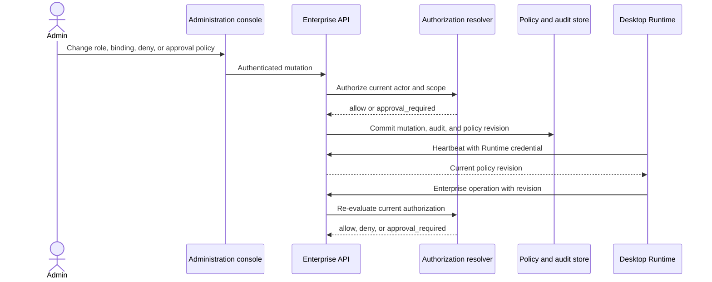

# Enterprise Role and Permission System

English | [中文](enterprise-role-permission-system.zh.md)

## Summary

This reference defines one enterprise authorization model for the administration console, enterprise API, and desktop client. The API is the source of truth for platform and organization permissions, while the desktop user remains the authority for local files, Shell, sandbox selection, and per-operation tool consent. A cross-plane operation proceeds only when the enterprise service authorizes the account and the local user authorizes the device action. The design applies to SaaS and private deployments and includes the migration from the repository's current role checks and custom-role records.

This page describes target behavior. [Current implementation](#current-implementation) distinguishes code that already exists from work required to complete the model.

## Table of Contents

- [Permission planes](#permission-planes)
- [Principals, resources, and scopes](#principals-resources-and-scopes)
- [Permission catalog](#permission-catalog)
- [Role model](#role-model)
- [Organization policy and entry points](#organization-policy-and-entry-points)
- [Authorization evaluation](#authorization-evaluation)
- [High-risk approval](#high-risk-approval)
- [Administration and desktop flows](#administration-and-desktop-flows)
- [Interfaces and records](#interfaces-and-records)
- [Audit and failure behavior](#audit-and-failure-behavior)
- [Current implementation](#current-implementation)
- [Migration](#migration)
- [Acceptance](#acceptance)
- [Further Exploration](#further-exploration)
- [Dev Note](#dev-note)

-----

## Permission planes

The product has two enterprise permission planes and one local consent plane. Organization policy is the day-to-day governance authority for its tenant; the platform can set non-bypassable safety limits but cannot silently act as an Organization administrator.

| Plane | Authority | Controls | Does not grant |
|---|---|---|---|
| Platform | Enterprise API platform policy | Deployment configuration, organizations, platform models, global plugin review, platform billing, and platform audit | Customer Session content or files on a member's device |
| Organization | Organization Owner and authorized administrators through the enterprise API | Members, roles, identity providers, organization data, Sessions, plugins, usage, and organization audit | Platform administration or operating-system access |
| Local consent | Desktop user and operating system | Local files, Shell, sandbox mode, native applications, and per-operation tool approval | Enterprise models, organization data, cloud plugins, or administrative APIs |

The existing Session permission preset remains a local execution setting that combines sandbox mode and approval policy. It does not represent an enterprise role and cannot satisfy an API permission check. An enterprise administrator cannot remotely bypass operating-system permission prompts or select `danger-full-access` for another user's device.

Organization policy controls enterprise services and data. It can deny model access, require an approved plugin, limit which devices can connect, restrict Session sharing and export, and require another administrator's approval. It cannot grant a desktop process access to a local path, change that user's sandbox mode, or answer a local tool-approval prompt. A platform limit can further restrict an Organization policy; no Organization policy can weaken a platform safety limit.

An Organization policy is a set of restrictions and workflow requirements, not a role grant. The API applies it after authenticating the organization and before executing an operation.

| Policy area | Organization-controlled settings | Default | Effect |
|---|---|---|---|
| Membership | Invite mode, allowed email domains, invitation lifetime, administrator invitation | Invitation required; invitations create Members only; no automatic domain-based administrator assignment | Rejects registration or invitation that violates the rule |
| Model access | Enabled platform model IDs and member/unit availability | Active Members may use the approved catalog within plan limits; no user-supplied provider credentials | Blocks model use even when the member has `model.use` |
| Device access | Runtime registration, minimum supported client version, revocation | Account-bound registered Runtime required | Blocks enterprise API use from unregistered, stale, or revoked devices |
| Session data | Sharing, cross-member reads, exports, deletion, retention | Private to owner; cross-member read, organization-wide search, and export denied | Narrows Session permissions; never grants a role permission |
| Plugins | Approved release IDs, allowed targets, organization installation | Members may install approved personal releases; organization installation, publication, and approval require separate authority | Blocks unapproved or disallowed plugin activation |
| Billing and audit | Billing visibility and mutation, audit access and export | Billing mutation and audit access require explicit role grants | Blocks access independently of a broad Administrator label |
| High-risk approval | Permission IDs, scopes, distinct approver rules, expiry | Two-person approval disabled | Adds approval to an already-authorized matching operation |

Changing a policy never adds a permission to a member. For example, allowing a model in the Organization catalog does not grant `model.use`, and granting `model.use` does not enable a model blocked by the policy or platform ceiling. An operation proceeds only when its role permission, Organization policy, platform ceiling, entitlement, and Runtime conditions all permit it; a required approval is an additional condition, not a substitute for any of them. Organization policies may deny, limit, or require a workflow, but cannot grant permissions, relax platform ceilings, or change local-device consent.

When the desktop is offline, local work may continue under the user's local settings. Model gateway calls, organization data reads or writes, cloud plugins, plugin publication, and management operations require a current online authorization and fail closed.

-----

## Principals, resources, and scopes

Authorization starts from authenticated principals and resources whose ownership can be resolved without trusting caller-provided labels.

| Principal | Authentication | Maximum authority |
|---|---|---|
| Human account | Browser session or desktop credential | Effective platform and organization role bindings for that account |
| Service account | Dedicated non-interactive credential | Intersection of its role bindings and credential scopes |
| Runtime installation | Account-bound desktop token and lease | Intersection of the account's current authority and the Runtime's organization, capability, and policy revision |
| Plugin activation | Installation-bound short-lived token | Intersection of the installing account, approved manifest permissions, target, device, release, and activation lease |

Scopes form two separate trees. A platform binding applies only to platform resources. An organization binding applies to the named Organization and its descendant Organizations; an OrgUnit binding applies to that unit and its descendant units inside the Organization. A resource inherits the scope of its authoritative owner, such as a Session's Organization and owning membership or a plugin activation's Organization and installing membership.

An applicable parent binding is inherited downward. An explicit `deny` at any applicable scope overrides every ordinary `allow`, including a more specific allow. Platform and organization trees are never combined during inheritance. Resource ownership, tenant isolation, active membership, and the system constraints below are evaluated independently of role inheritance.

The service enforces these system constraints before role permissions:

- Every Organization retains at least one distinct active Owner.
- Only an Owner can grant or revoke Owner or Administrator authority.
- Recovery operations needed to restore the last viable Owner cannot be removed with a custom role or `deny` binding.
- A principal cannot grant a role, permission, scope, credential, Runtime, or plugin activation broader than its own delegable authority.
- A platform operator cannot use platform authority to enter a customer tenant or read customer Session content.

-----

## Permission catalog

Each permission has a stable lowercase `resource.action` ID. The catalog owns its label, description, plane, risk marker, delegability, and supported scope kinds. Renaming display copy does not change the ID. Removing or repurposing an ID is forbidden after the unified catalog ships; a replacement receives a new ID and the old definition becomes disabled after all bindings migrate. Phase one may replace current pre-stable IDs while updating every consumer and stored binding in the same migration.

The catalog separates viewing, changing, publishing, using, exporting, and revoking where those actions have different risks. `own` means records owned by the current membership; `assigned` means resources explicitly assigned to that membership; `all` means the selected Organization or inherited child scope.

| Permission IDs | Protected organization operation | Default scope |
|---|---|---|
| `organization.read`, `organization.update`, `organization.units.read`, `organization.units.manage`, `organization.policy.read`, `organization.policy.manage` | Read and change the organization profile, hierarchy, and policy | Organization or assigned OrgUnit |
| `member.read`, `member.invite`, `member.update`, `member.suspend`, `member.remove`, `member.units.assign` | Read directory fields, invite, update, suspend, remove, and assign organizational units | Organization or assigned OrgUnit |
| `role.read`, `role.create`, `role.update`, `role.disable`, `role.bind`, `role.unbind`, `role.effective.read` | Read role definitions, create/edit/disable custom roles, bind/unbind roles, and inspect effective permissions | Organization or assigned OrgUnit |
| `identity.read`, `identity.provider.manage`, `identity.sync.preview`, `identity.sync.approve`, `identity.sync.run` | Configure identity providers and preview, approve, or run directory synchronization | Organization |
| `runtime.read`, `runtime.register`, `runtime.revoke`, `runtime.policy.manage` | View, register, revoke devices, and set enterprise connection requirements | Organization; self-revoke is membership-owned |
| `session.create`, `session.read.own`, `session.read.assigned`, `session.read.all`, `session.share`, `session.export.own`, `session.export.all`, `session.delete.own`, `session.delete.all` | Create, read, share, export, and delete Sessions at the named ownership scope | Membership, assigned unit, or Organization |
| `model.catalog.read`, `model.use`, `model.access.manage` | View approved model catalog, call an enabled model, and set organization model access | Organization; use also checks member and device restrictions |
| `plugin.catalog.read`, `plugin.install.own`, `plugin.install.organization`, `plugin.publish`, `plugin.release.manage`, `plugin.approve`, `plugin.revoke` | Browse, install personal/organization plugins, publish releases, and approve or revoke organization releases | Membership or Organization |
| `usage.read.own`, `usage.read.all`, `usage.export` | Read personal or organization usage and export reports | Membership or Organization |
| `billing.read`, `billing.wallet.manage`, `billing.subscription.manage`, `billing.reconcile` | Read bills, manage wallet/subscription, and reconcile organization usage | Organization |
| `audit.read`, `audit.export` | Search and export organization audit records | Organization |
| `approval.policy.manage`, `approval.request.read`, `approval.decide` | Set approval rules, review requests, and approve or reject them | Organization or matched resource scope |

The platform catalog is separate: `platform.organization.read`, `platform.organization.manage`, `platform.deployment.policy.manage`, `platform.model.catalog.manage`, `platform.plugin.review`, `platform.billing.manage`, and `platform.audit.read`/`platform.audit.export`. Platform audit permission does not expose customer Session content. Customer content access requires an Organization permission and an Organization-scoped actor; platform support access uses a separate, time-limited, customer-approved access grant and is audited as that grant.

Custom roles may reference enabled permissions from their own plane only. They cannot contain system constraints, local-consent controls, or unknown IDs. System roles use the same versioned `RoleDefinition` and `RolePermission` records as custom roles but are immutable through organization APIs. The API requires the narrowest permission that fully covers the requested action and never treats `read` as permission to export or mutate.

-----

## Role model

Roles are named bundles of the granular permissions above, not separate authorization logic. The built-in role bundles below are onboarding defaults; an Organization Owner may create narrower custom roles and assign them within the Owner's delegable scope.

| Role template | Default permission bundle |
|---|---|
| Owner | All organization permissions, including Owner transfer and recovery; cannot grant platform permissions or local-device access |
| Administrator | Organization profile, units, members, non-Owner roles, identity, runtime policy, organization plugins, sessions, and organization audit; excludes Owner transfer, billing changes, and approval of own requests |
| Member | Organization and approved-model catalog reads, model use, own Session lifecycle, personal plugin installation, own usage, and self Runtime registration/revocation |
| Security Reviewer | Organization/role/member/runtime/policy reads, assigned or policy-approved Session reads/exports, plugin approval/revocation, approval decisions, and audit read/export |
| Plugin Publisher | Plugin catalog read, release publication and assigned release management; no approval of own release, organization plugin installation policy, or Session content access |
| Finance Auditor | Organization billing, usage read/export, reconciliation visibility, and audit read; no wallet or subscription mutation |

Platform role templates are separate: Platform Super Administrator manages platform permissions for bootstrap and recovery; Platform Operator manages organization lifecycle and deployment operations; Platform Security Auditor reads platform audit; Platform Model Administrator manages platform model definitions; Platform Plugin Reviewer reviews platform releases; Platform Finance Administrator manages platform billing. None receives Organization Session permissions through its platform role.

One membership may hold multiple role bindings. Effective permissions are their union after scope resolution and explicit-deny subtraction, subject to system constraints, platform ceilings, entitlements, device rules, and approval policy. A role template does not make every operation in its domain identical: exporting a Session still requires `session.export.*`, even for a role that can read it. Disabling a custom role immediately removes its permissions from new decisions; existing credentials do not preserve them.

-----

## Organization policy and entry points

The Organization owns its policy. The same policy can be administered from the desktop client or the Web administration console through the authenticated enterprise API; neither interface is the authority. The desktop is the primary entry for member onboarding and daily team governance, while the Web console is the full administration surface and the only interface for platform-wide operations.

| Entry | Organization administrator can | Platform operator can | Authority |
|---|---|---|---|
| Desktop client: Organization → Manage organization | Onboard Members; manage unit membership, approved model/plugin availability, Runtime revocation, approval requests, and routine policy settings; perform any other operation only when its permission and confirmation requirements are met | No customer-organization actions unless separately granted an explicit customer access grant | Organization API and current membership |
| Web console: select organization → Organization administration | Manage the same Organization policy, with role design, identity-provider setup, billing, audit/reporting, and bulk workflows | Inspect platform metadata; customer data remains unavailable without a customer-approved access grant | Organization API and current membership |
| Web console: Platform operations | No platform operation unless separately assigned a platform role | Manage only the assigned platform catalog and deployment resources | Platform API and platform role |

The desktop organization area is the convenient entry for members and routine team administration. It shows the active Organization, the administrator's effective roles and scopes, policy revision, pending approvals, and the reason an action is unavailable. It offers policy drafts, an impact preview, and a final confirmation before a change takes effect. The Web console is the preferred interface for complex role design, identity-provider changes, billing, organization-wide data rules, and bulk changes because it can show broader tables and impact reports; these remain Organization API operations and are not a separate permission system. Platform operations stay in the platform area of the Web console.

Initial bootstrap creates an Organization Owner. The Owner may delegate organization administration to an Administrator or grant a narrower custom role. A platform operator can create, suspend, or configure an Organization according to platform permissions, but this does not create a membership or Organization role binding. Support access to customer content requires an explicit, scoped, time-limited grant approved by an Organization Owner and produces a distinct audit trail.

The organization administration flow is:

1. The user signs in on desktop or the Web console and selects an Organization. The API resolves the account and active membership; the client does not accept an Organization ID as proof of access.
2. The client loads the effective-permission view, matched role bindings, policy revision, and available actions. It hides actions the user cannot request and shows the owning role/scope and a reason for denied actions.
3. The administrator edits a policy draft. The interface names the affected Organization or unit, members/devices/resources, permission IDs, and whether the change can lock out administrators or broaden access.
4. The API re-authorizes the mutation against current policy. A high-risk approval rule creates an approval request; otherwise the API commits the mutation, audit record, and new policy revision in one transaction.
5. Connected desktop clients receive the new revision through heartbeat or refresh. They discard cached explanations and reload policy. Every later protected API call is re-authorized by the server.
6. For a device-local action, the desktop separately applies the user's sandbox and approval choices. Organization policy may disable the associated enterprise service but cannot silently grant local access.

Default Organization policy follows least privilege: a new member receives the Member role, but invitations cannot assign an administrative role; invitation links expire; Members can use only approved models within plan limits and install only approved personal plugin releases. Session content is private to its owner, with cross-member reads, organization-wide search, and exports denied by default. Organization plugin installation, publication, approval, custom permission grants, identity-provider changes, billing mutation, and device-wide policy changes require explicit permissions. Audit and billing records are visible only to roles granted their specific read permissions. An Organization Owner can tighten these defaults; weakening a platform ceiling is rejected. Every default can be changed only through an authorized policy mutation, and policy changes do not silently add a role permission.

-----

## Authorization evaluation

Every protected service operation calls one resolver with the authenticated principal, requested permission, authoritative resource reference, request context, and optional presented policy revision. The resolver evaluates the following ordered stages and stops on a definitive refusal:

1. Validate the credential and derive the account, organization, and Runtime or service identity without accepting a caller-selected tenant identity.
2. Require active account, Organization, membership, Runtime lease, service credential, and plugin activation where each applies.
3. Enforce platform safety ceilings, tenant ownership, and system constraints, including final-Owner recovery and platform separation.
4. Resolve Organization policy for the authoritative resource and reject disabled capabilities, out-of-policy resources, or operations that violate required workflows.
5. Resolve applicable Organization, ancestor-Organization, OrgUnit, and ancestor-OrgUnit role bindings.
6. Expand enabled role definitions and apply explicit deny precedence to the requested permission.
7. Check subscription entitlements, quotas, resource state, device restrictions, and other non-role limits.
8. Return `approval_required` when an enabled approval policy matches the otherwise authorized high-risk operation; otherwise continue.
9. Compare the presented policy revision with the current Organization revision for Runtime requests and reject stale clients before execution.

The result is `allow`, `deny`, or `approval_required`. A deny includes a stable non-secret reason code such as `unauthenticated`, `tenant_mismatch`, `principal_inactive`, `runtime_revoked`, `permission_missing`, `explicit_deny`, `entitlement_missing`, `approval_required`, `approval_invalid`, or `policy_stale`. External responses do not reveal whether another tenant owns a requested ID.

The UI may hide or disable controls from an effective-permission view, but that view is informational. The API resolves authorization again inside the protected read or mutation transaction. A policy revision invalidates caches and detects stale Runtime requests; it never replaces the current authorization check.

-----

## High-risk approval

Two-person approval is disabled by default. An Organization can enable an `ApprovalPolicy` for selected high-risk permissions and scopes. Platform policy owns the equivalent rule for platform operations.

| Operation | Default risk | Recommended approver permission |
|---|---|---|
| Grant or revoke Owner/Administrator or edit a high-risk role | High | `role.bind` or `role.manage` in the same scope |
| Export or bulk-read other members' Session content | High | `approval.approve` plus `session.export` |
| Publish, approve, or revoke organization/plugin code | High | `approval.approve` plus the corresponding plugin permission |
| Change identity provider or publish directory synchronization | High | `approval.approve` plus `identity.manage` |
| Change billing, quota, or organization-wide policy | High | `approval.approve` plus the corresponding management permission |
| Revoke a Runtime or install a personal plugin | Normal | No approval unless organization policy opts in |

The requester must already pass RBAC, scope, and entitlement checks. The service then creates an `ApprovalRequest` bound to the requester, permission ID, resource, canonical operation digest, policy revision, and expiry. The approver must be a different active account and independently hold both `approval.approve` and the permission required by the policy in the same scope.

Approval does not execute the action. On retry, the service atomically re-evaluates the requester's current authorization, verifies the unchanged operation digest and policy revision, consumes one approved decision, performs the operation, and appends its audit record. Rejected, expired, consumed, cancelled, self-approved, stale, or payload-mismatched requests cannot authorize execution.

-----

## Administration and desktop flows

The administration console edits policy through the same API that enforces it. Policy mutations commit their audit fact and increment the affected policy revision in the same transaction.

For a local operation, the desktop applies the Session's user-selected sandbox and approval policy without asking the enterprise service to grant local access. For a cross-plane operation, such as a cloud-authorized plugin reading a local file, the enterprise call must first be authorized and the local Host must then obtain the user's local consent. Either refusal ends the operation, and neither decision expands the other plane.

The desktop reads its current Organization, Runtime state, policy revision, effective-permission explanation, and pending approvals. It cannot create role bindings, alter decision fields, or use a cached explanation as an authorization token. Losing the Runtime lease stops new enterprise work and cloud calls while leaving local data under the user's local settings.

-----

## Interfaces and records

The target records are language-independent and use opaque branded identifiers at TypeScript boundaries. Stored and wire records validate all enum values, IDs, scope references, revisions, timestamps, and bounded collections.

| Record | Required fields and rules |
|---|---|
| `PermissionDefinition` | Stable ID, resource, action, plane, description, enabled, high-risk, delegable, supported scopes |
| `RoleDefinition` | ID, plane, owning Organization for custom roles, name, description, system flag, enabled, monotonically increasing version |
| `RolePermission` | Role ID and permission ID; both must belong to the same plane |
| `RoleBinding` | Principal or membership, role ID, scope kind and ID, `allow` or `deny`, source, creation actor and time |
| `AuthorizationDecision` | Outcome, permission ID, resource reference, matched scope and roles, non-secret reason code, policy revision, optional approval requirement |
| `ApprovalPolicy` | Owning plane and scope, matched permission IDs, enabled flag, eligible approver rule, expiry, version |
| `ApprovalRequest` | Requester, permission, resource, operation digest, policy revision, state, creation and expiry |
| `ApprovalDecision` | Request ID, distinct approver, approve or reject result, decision time, optional bounded reason |

The API exposes separate management and self-service views:

- Administration reads the permission catalog and manages role definitions, role permissions, bindings, deny effects, approval policies, requests, and decisions within the administrator's own authority.
- Desktop self-service reads the current principal, Organization, Runtime state, policy revision, effective decisions with their sources, and approval status. It can manage only resources explicitly defined as self-service, such as its own Runtime revocation or personal plugin installation.
- Protected domain routes call the internal resolver instead of accepting a client-supplied decision. Bulk listings filter rows through tenant ownership and the permission appropriate to their content sensitivity.

Every change to a permission definition, role definition, role permission, role binding, approval policy, membership status, Runtime restriction, or organization policy increments the owning `policyRevision`. Platform policy uses an independent platform revision. A transaction either commits the policy mutation, new revision, and audit fact together or commits none of them.

-----

## Audit and failure behavior

Audit records capture successful policy mutations, protected content reads, approval transitions, Runtime registration and revocation, plugin activation, and high-risk execution. Each record includes actor, effective Organization, Runtime or service identity when present, action, resource, policy revision, request trace, outcome, reason code, and approval request ID where applicable. Audit detail stores identifiers and decision metadata, not credentials, model prompts, local file contents, or provider secrets.

Authorization defaults to deny when a role, permission, scope, owner, revision, entitlement, approval record, or policy dependency cannot be resolved. A temporary control-plane failure cannot be converted into local enterprise authority. Mutations use idempotency keys where retry could duplicate an effect; approval consumption and the protected mutation share one transaction.

-----

## Current implementation

The repository already contains several parts of this model:

- The enterprise API stores Organizations, memberships, OrgUnits, fixed role bindings, a permission catalog, versioned custom roles, custom-role permissions, and `allow`/`deny` binding effects.
- Transaction-local tenant selection and forced PostgreSQL RLS isolate organization tables.
- `requirePlatform`, `requireRole`, and `requirePermission` protect different route groups; final-Owner checks protect membership and role changes.
- Desktop authorization issues an account- and Organization-bound Runtime credential. Heartbeat returns `policyRevision`, revocation ends new Runtime work, and model requests can reject a stale revision.
- Plugin installation and activation retain permission digests, per-installation revisions, device target state, and short-lived activation leases.
- Audit writes accompany protected reads and mutations on existing routes. Session permission presets separately control local sandbox and approval behavior.

The implementation does not yet satisfy the complete design:

- Routes mix fixed-role checks and permission checks instead of using one resolver.
- OrgUnit bindings are stored, but decisions do not evaluate the requested resource's OrgUnit ancestry.
- The effective-permissions route does not fully expand fixed roles, inherited scopes, deny precedence, disabled roles, or decision sources.
- RBAC and related policy mutations do not consistently increment the Organization policy revision.
- Platform authority is one `platform_admin` marker rather than separated platform roles.
- No durable two-person approval policy, request, decision, or atomic consumption workflow exists.
- The desktop does not present a complete effective-permission explanation or stable refusal reason.

-----

## Migration

The public API is pre-stable, so each phase updates every repository consumer and test together. The implementation does not retain parallel long-term authorization paths.

1. **Unify definitions.** Add versioned system role definitions and platform roles, migrate fixed role names to their system IDs, complete the permission catalog, and retain existing custom-role IDs and bindings.
2. **Centralize decisions.** Introduce the resolver and effective-decision view, implement Organization and OrgUnit ancestry, deny precedence, system constraints, source explanations, and transaction-local audit context.
3. **Convert routes.** Replace `requireRole` and ad hoc role arrays with permission checks, assigning one stable permission to every protected API operation and covering list-content sensitivity.
4. **Complete administration.** Add platform-role, organization-role, binding, deny, effective-access, and policy-revision views to the administration console, with server-filtered controls and explicit high-risk labels.
5. **Complete desktop policy refresh.** Expose the self effective-access view, invalidate cached UI from heartbeat revisions, reject stale cloud operations, and keep Session sandbox and approval choices user-owned.
6. **Add high-risk approval.** Add policy, request, and decision storage; enforce separation of requester and approver; bind decisions to digest, revision, expiry, and one atomic use.

Each phase migrates stored records monotonically, increments the SQLite or PostgreSQL schema version owned by that domain, and updates all TypeScript and desktop consumers. Released Session JSONL is unchanged because enterprise authorization and approval records live in enterprise storage; a future model-visible permission fact would require its own adjacent Session format decision.

-----

## Acceptance

Implementation is complete only when focused integration tests prove these outcomes:

- A principal cannot discover or operate on another tenant's resource, including through guessed opaque IDs.
- Platform roles perform only their assigned platform duties and cannot read customer Session content.
- Organization and OrgUnit grants inherit downward, do not inherit sideways, and an applicable deny overrides every allow.
- A disabled or changed custom role affects the next decision and advances the policy revision.
- The final active Owner cannot be removed, suspended, denied recovery authority, or left without a viable replacement.
- Revoked, expired, wrong-Organization, and stale-revision Runtimes cannot start enterprise work.
- Offline desktop sessions retain user-authorized local work while enterprise models, cloud plugins, organization data, and management operations fail closed.
- A local allow cannot compensate for missing enterprise permission, and enterprise permission cannot bypass local denial.
- Self-approval, unauthorized approval, replay, expiry, cancellation, digest mismatch, revision mismatch, and changed requester authority all reject execution.
- Approved execution consumes exactly one decision and commits the protected mutation, policy effects, and audit facts atomically.
- Administration and desktop UIs hide unavailable actions for clarity, while direct API calls receive the same authoritative refusal.

-----

## Further Exploration

- [Enterprise identity and organization design](enterprise-identity-and-organization.md) — account, membership, Organization, OrgUnit, and Runtime ownership.
- [Enterprise plugin model](../../enterprise-plugins.md) — Client and Host target permissions, publication, activation, and revocation.
- [Permission presets](../../../packages/interaction/permission-presets/README.md) — the separate user-owned Session sandbox and approval setting.
- [Enterprise API](../../../apps/api/README.md) — current tenant authorization, Runtime, model, Session, and audit implementation.
- [Authorization decision Agent Note](../../../.agents/notes/proposed/architecture/2026-09-30-enterprise-role-permission-system.md) — rationale, alternatives, risks, and acceptance criteria.

## Dev Note

This target design does not claim that the migration phases or two-person approval workflow are implemented.
