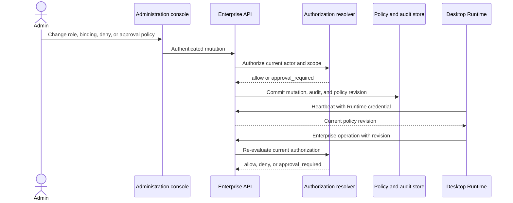

# 企业角色权限体系

[English](enterprise-role-permission-system.md) | 中文

## 概要

本文为管理后台、企业 API 和桌面客户端定义统一的企业授权模型。API 是平台和组织权限的真源，桌面用户仍然决定本机文件、Shell、沙箱选择和逐次工具审批。跨平面操作只有在企业服务授权账号且本机用户同意设备操作时才能继续。该设计同时适用于 SaaS 与私有化部署，并包含从仓库现有角色检查和自定义角色记录迁移到目标模型的步骤。

本文描述目标行为。[当前实现](#current-implementation)会区分仓库已经具备的代码与完成该模型仍需开展的工作。

## 目录

- [权限平面](#permission-planes)
- [主体、资源和作用域](#principals-resources-and-scopes)
- [权限目录](#permission-catalog)
- [角色模型](#role-model)
- [组织策略与入口](#organization-policy-and-entry-points)
- [授权计算](#authorization-evaluation)
- [高风险审批](#high-risk-approval)
- [管理端和桌面端流程](#administration-and-desktop-flows)
- [接口与记录](#interfaces-and-records)
- [审计与失败行为](#audit-and-failure-behavior)
- [当前实现](#current-implementation)
- [迁移](#migration)
- [验收](#acceptance)
- [延伸阅读](#further-exploration)
- [开发备注](#dev-note)

-----

## 权限平面

产品包含两个企业权限平面和一个本机同意平面。组织策略是租户日常治理的权威；平台可以设置不可绕过的安全上限，但不能静默地代替组织管理员操作。

| 平面 | 权威方 | 控制内容 | 不会授予 |
|---|---|---|---|
| 平台 | 企业 API 平台策略 | 部署配置、组织、平台模型、全局插件审核、平台计费和平台审计 | 客户会话内容或成员设备上的文件 |
| 组织 | 通过企业 API 行使权限的组织 Owner 和获授权管理员 | 成员、角色、身份提供商、组织数据、会话、插件、用量和组织审计 | 平台管理或操作系统访问权限 |
| 本机同意 | 桌面用户和操作系统 | 本机文件、Shell、沙箱模式、原生应用和逐次工具审批 | 企业模型、组织数据、云插件或管理 API |

现有会话权限预设仍是组合沙箱模式与审批策略的本机执行设置。它不表示企业角色，也不能满足 API 权限检查。企业管理员不能远程绕过操作系统权限提示，也不能替另一名用户的设备选择 `danger-full-access`。

组织策略控制企业服务和数据。它可以拒绝模型访问、要求使用已批准插件、限制可连接设备、限制会话共享与导出并要求另一名管理员审批。它不能授予桌面进程访问本机路径的权限、改变用户的沙箱模式或替用户回应本机工具审批。平台上限可以进一步限制组织策略；组织策略不能削弱平台安全上限。

组织策略是限制和工作流要求，不是角色授权。API 在认证组织后、执行操作前应用策略。

| 策略领域 | 组织可配置内容 | 默认值 | 效果 |
|---|---|---|---|
| 成员 | 邀请模式、允许的邮箱域、邀请有效期、管理员邀请 | 需要邀请；邀请只创建 Member；不会根据邮箱域自动分配管理员 | 拒绝违反规则的注册或邀请 |
| 模型访问 | 已启用的平台模型 ID 以及成员／单元可用性 | 有效 Member 可在套餐限额内使用已批准目录；不接受用户自带提供方凭据 | 即使成员拥有 `model.use`，仍可阻止模型调用 |
| 设备访问 | Runtime 注册、最低客户端版本、撤销 | 必须使用账号绑定且已注册的 Runtime | 阻止未注册、陈旧或已撤销设备调用企业 API |
| 会话数据 | 共享、跨成员读取、导出、删除、保留期 | 仅所有者可见；默认拒绝跨成员读取、组织范围搜索和导出 | 收窄会话权限，绝不授予角色权限 |
| 插件 | 已批准 release ID、允许 target、组织安装 | Member 可安装已批准的个人 release；组织安装、发布和审批需要独立授权 | 阻止未批准或不允许的插件激活 |
| 计费与审计 | 账单可见性和变更权限、审计访问与导出 | 读取计费和审计数据需要明确的角色权限 | 不会因宽泛的 Administrator 名称而放行 |
| 高风险审批 | 权限 ID、作用域、不同审批人规则、有效期 | 关闭双人审批 | 为已获授权且匹配的操作追加审批要求 |

修改策略不会为成员增加权限。例如，在组织目录中允许某个模型不等于授予 `model.use`；授予 `model.use` 也不会启用被策略或平台上限阻止的模型。只有角色权限、组织策略、平台上限、套餐权益和 Runtime 条件都允许时，操作才会继续；策略要求审批时，审批是额外条件，不能替代其中任何一项。组织策略可以拒绝、限制或要求工作流，但不能授予权限、放宽平台上限或改变本机设备同意。

桌面离线时，本机工作可以按用户的本机设置继续。模型网关调用、组织数据读写、云插件、插件发布和管理操作需要当前在线授权，并在离线时默认拒绝。

-----

## 主体、资源和作用域

授权从已认证主体和可在不信任调用方标签的情况下解析归属的资源开始。

| 主体 | 认证方式 | 最大权限 |
|---|---|---|
| 人员账号 | 浏览器会话或桌面凭据 | 该账号有效的平台和组织角色绑定 |
| 服务账号 | 独立的非交互凭据 | 其角色绑定与凭据作用域的交集 |
| Runtime 安装 | 绑定账号的桌面 token 和租约 | 账号当前权限与 Runtime 的组织、能力和策略修订的交集 |
| 插件激活 | 绑定安装记录的短期 token | 安装账号、已审核 manifest 权限、target、设备、release 和激活租约的交集 |

作用域形成两棵相互独立的树。平台绑定只适用于平台资源。组织绑定适用于指定 Organization 及其后代 Organization；OrgUnit 绑定适用于该单元及其在 Organization 内的后代单元。资源继承其权威所有者的作用域，例如会话的 Organization 和所有者成员关系，或插件激活的 Organization 和安装成员关系。

适用的父级绑定向下继承。任一适用作用域上的显式 `deny` 都覆盖所有普通 `allow`，包括更具体作用域上的 allow。平台树与组织树在继承计算中永不合并。资源归属、租户隔离、有效成员关系以及下述系统约束独立于角色继承进行检查。

服务在角色权限之前强制执行以下系统约束：

- 每个 Organization 至少保留一名不同的有效 Owner。
- 只有 Owner 可以授予或撤销 Owner 或 Administrator 权限。
- 恢复最后一个可用 Owner 所需的操作不能通过自定义角色或 `deny` 绑定移除。
- 主体不能授予超出自身可委派权限的角色、权限、作用域、凭据、Runtime 或插件激活。
- 平台运维人员不能使用平台权限进入客户租户或读取客户会话内容。

-----

## 权限目录

每项权限拥有稳定的小写 `resource.action` ID。权限目录拥有其标签、说明、平面、风险标记、可委派性和支持的作用域类型。修改展示文案不会改变 ID。统一目录交付后禁止删除或改变 ID 的含义；替代权限使用新 ID，所有绑定迁移完成后再禁用旧定义。第一阶段可以替换当前 pre-stable ID，但必须在同一次迁移中更新所有消费方和已存储绑定。

权限目录分别控制读取、修改、发布、使用、导出和撤销，因为这些操作的风险不同。`own` 表示当前成员拥有的记录；`assigned` 表示明确分配给该成员的资源；`all` 表示所选 Organization 或继承的子级作用域。

| 权限 ID | 受保护的组织操作 | 默认作用域 |
|---|---|---|
| `organization.read`、`organization.update`、`organization.units.read`、`organization.units.manage`、`organization.policy.read`、`organization.policy.manage` | 读取和修改组织资料、层级及策略 | Organization 或获分配 OrgUnit |
| `member.read`、`member.invite`、`member.update`、`member.suspend`、`member.remove`、`member.units.assign` | 读取目录字段、邀请、更新、暂停、移除成员和分配组织单元 | Organization 或获分配 OrgUnit |
| `role.read`、`role.create`、`role.update`、`role.disable`、`role.bind`、`role.unbind`、`role.effective.read` | 读取角色定义、创建／编辑／禁用自定义角色、绑定／解绑角色和查看有效权限 | Organization 或获分配 OrgUnit |
| `identity.read`、`identity.provider.manage`、`identity.sync.preview`、`identity.sync.approve`、`identity.sync.run` | 配置身份提供商以及预览、批准或运行目录同步 | Organization |
| `runtime.read`、`runtime.register`、`runtime.revoke`、`runtime.policy.manage` | 查看、注册、撤销设备并设置企业连接要求 | Organization；自我撤销归成员本人 |
| `session.create`、`session.read.own`、`session.read.assigned`、`session.read.all`、`session.share`、`session.export.own`、`session.export.all`、`session.delete.own`、`session.delete.all` | 在指定归属范围创建、读取、共享、导出和删除会话 | 成员本人、获分配单元或 Organization |
| `model.catalog.read`、`model.use`、`model.access.manage` | 查看已批准模型目录、调用已启用模型和设置组织模型访问策略 | Organization；调用还要检查成员和设备限制 |
| `plugin.catalog.read`、`plugin.install.own`、`plugin.install.organization`、`plugin.publish`、`plugin.release.manage`、`plugin.approve`、`plugin.revoke` | 浏览、安装个人／组织插件、发布 release 以及批准／撤销组织 release | 成员本人或 Organization |
| `usage.read.own`、`usage.read.all`、`usage.export` | 读取个人或组织用量并导出报告 | 成员本人或 Organization |
| `billing.read`、`billing.wallet.manage`、`billing.subscription.manage`、`billing.reconcile` | 读取账单、管理钱包／订阅和核对组织用量 | Organization |
| `audit.read`、`audit.export` | 搜索和导出组织审计记录 | Organization |
| `approval.policy.manage`、`approval.request.read`、`approval.decide` | 设置审批规则、查看申请并批准或拒绝 | Organization 或匹配的资源作用域 |

平台目录单独定义为：`platform.organization.read`、`platform.organization.manage`、`platform.deployment.policy.manage`、`platform.model.catalog.manage`、`platform.plugin.review`、`platform.billing.manage` 和 `platform.audit.read`／`platform.audit.export`。平台审计权限不暴露客户会话内容。客户内容访问需要组织权限和组织作用域操作者；平台支持人员访问客户内容需要另行取得由客户批准、限时且有作用域的访问授权，并单独记录审计。

自定义角色只能引用其所属平面中已启用的权限。它们不能包含系统约束、本机同意控制或未知 ID。系统角色与自定义角色使用相同的版本化 `RoleDefinition` 和 `RolePermission` 记录，但组织 API 不能修改系统角色。API 对每项操作要求覆盖该操作的最窄权限，绝不把 `read` 当作导出或修改权限。

-----

## 角色模型

角色是上述细粒度权限的具名组合，不是独立的授权逻辑。以下内置角色组合是便于入门的默认模板；Organization Owner 可以创建更窄的自定义角色，并在自身可委派的作用域内分配。

| 角色模板 | 默认权限组合 |
|---|---|
| Owner | 全部组织权限，包括 Owner 转移与恢复；不能授予平台权限或设备本机访问权限 |
| Administrator | 组织资料、单元、成员、非 Owner 角色、身份、Runtime 策略、组织插件、会话和组织审计；不含 Owner 转移、计费变更和审批自己的申请 |
| Member | 组织与已批准模型目录读取、模型调用、本人会话生命周期、个人插件安装、本人用量以及本人 Runtime 注册／撤销 |
| 安全审核员 | 组织／角色／成员／Runtime／策略读取、获分配或策略批准的会话读取／导出、插件批准／撤销、审批决定以及审计读取／导出 |
| 插件发布者 | 插件目录读取、发布 release 和管理分配的 release；不能批准自己的 release、修改组织插件安装策略或访问会话内容 |
| 财务审计员 | 组织计费、用量读取／导出、核对可见性和审计读取；不能修改钱包或订阅 |

平台角色模板彼此独立：平台超级管理员管理初始化和恢复所需的平台权限；平台运维管理员管理组织生命周期和部署操作；平台安全审计员读取平台审计；平台模型管理员管理平台模型定义；平台插件审核员审核平台 release；平台财务管理员管理平台计费。平台角色不会附带组织会话权限。

一条成员关系可以拥有多个角色绑定。有效权限是完成作用域解析后各绑定权限的并集，再扣除显式拒绝，并受系统约束、平台上限、权益、设备规则和审批策略限制。角色模板不会让同一领域内所有操作变得等价：即使某角色可以读取会话，导出仍需 `session.export.*`。禁用自定义角色会立即从新决定中移除它的权限；现有凭据不会保留这些权限。

-----

## 组织策略与入口

组织拥有自己的策略。同一套策略可以由桌面客户端或 Web 管理后台通过已认证企业 API 管理；两个界面都不是权限权威方。桌面端是成员加入和团队日常治理的主要入口，Web 后台提供完整管理界面，也是平台级操作的唯一入口。

| 入口 | 组织管理员可以执行 | 平台运维人员可以执行 | 权限权威 |
|---|---|---|---|
| 桌面客户端：Organization → 管理组织 | 加入和管理成员、分配单元、管理已批准模型／插件的可用范围、撤销 Runtime、处理审批申请及日常策略；其他操作仍需对应权限和确认 | 除非另获明确的客户访问授权，否则不能操作客户组织 | 组织 API 和当前成员关系 |
| Web 后台：选择组织 → 组织管理 | 管理同一组织策略，包括角色设计、身份提供商、计费、审计／报表和批量工作流 | 查看平台元数据；没有客户批准的访问授权时不能读取客户数据 | 组织 API 和当前成员关系 |
| Web 后台：平台操作 | 除非另获平台角色，否则不能执行平台操作 | 仅管理分配的平台目录和部署资源 | 平台 API 和平台角色 |

桌面端组织区域是成员和日常团队管理的便捷入口。它显示当前 Organization、管理员的有效角色与作用域、策略修订、待处理审批，以及某项操作不可用的原因。管理员可以编辑策略草稿、预览影响，并在生效前确认。角色设计、身份提供商变更、计费、组织范围数据规则和批量操作优先使用 Web 后台，因为它能展示更完整的列表和影响报告；这些仍是组织 API 操作，不构成另一套权限系统。平台操作仅在 Web 后台的平台区域执行。

初始化组织时会创建一个 Owner。Owner 可以委派组织管理权限给 Administrator，或授予范围更窄的自定义角色。平台运维人员可以根据平台权限创建、暂停或配置 Organization，但这不会自动创建成员关系或组织角色绑定。平台支持人员需要读取客户内容时，必须取得由 Organization Owner 明确批准且限定范围和时间的访问授权，并写入独立审计轨迹。

组织管理流程如下：

1. 用户在桌面端或 Web 后台登录并选择 Organization。API 解析账号和有效成员关系；客户端不能把调用方提供的 Organization ID 当作访问凭据。
2. 客户端加载有效权限视图、命中的角色绑定、策略修订和可用操作。界面隐藏用户无权申请的操作，并显示授权来源角色／作用域以及拒绝原因。
3. 管理员编辑策略草稿。界面明确显示受影响的 Organization 或单元、成员／设备／资源、权限 ID，以及此变更是否可能锁定管理员或扩大访问范围。
4. API 根据当前策略重新授权此变更。若命中高风险审批规则，则创建审批申请；否则 API 在同一事务中提交变更、审计记录和新的策略修订。
5. 在线桌面客户端通过心跳或刷新收到新修订，丢弃缓存的权限说明并重新加载策略。后续每个受保护 API 调用仍由服务端重新授权。
6. 对设备本机操作，桌面端另外应用用户的沙箱和审批选择。组织策略可以禁用关联的企业服务，但不能静默授予本机访问权限。

组织默认策略遵循最小权限：新成员获得 Member 角色，但邀请不能分配管理员角色；邀请链接会过期；Member 只能在套餐限额内使用已批准的模型，并安装已批准的个人插件。会话内容默认仅所有者可见，跨成员读取、组织范围搜索和导出默认拒绝。组织插件安装、发布、审批、自定义权限授予、身份提供商变更、计费修改和设备范围策略变更都需要明确权限。只有获得相应读取权限的角色才能查看审计和计费记录。Organization Owner 可以收紧这些默认值；任何放宽平台上限的请求都会被拒绝。每项默认策略变更都必须经过授权，且不会悄然增加角色权限。

-----

## 授权计算

每个受保护的服务操作使用已认证主体、请求权限、权威资源引用、请求上下文和可选的已提供策略修订调用同一个解析器。解析器按以下顺序计算，并在得到确定拒绝时停止：

1. 验证凭据并推导账号、组织以及 Runtime 或服务身份，不接受调用方自行选择的租户身份。
2. 按适用情况要求账号、Organization、成员关系、Runtime 租约、服务凭据和插件激活均有效。
3. 强制执行租户归属和系统约束，包括最后 Owner 保护与平台职责隔离。
4. 根据权威资源解析组织策略，并拒绝已禁用能力、超出允许范围的资源或违反必需工作流的操作。
5. 解析适用的平台、Organization、祖先 Organization、OrgUnit 和祖先 OrgUnit 角色绑定。
6. 展开已启用的角色定义，并对请求权限应用显式 deny 优先规则。
7. 检查订阅权益、配额、资源状态、设备限制和其他非角色限制。
8. 启用的审批策略匹配到其他条件均已获授权的高风险操作时，返回 `approval_required`；否则继续。
9. 对 Runtime 请求比较已提供策略修订和当前 Organization 修订，并在执行前拒绝陈旧客户端。

结果为 `allow`、`deny` 或 `approval_required`。拒绝携带稳定且不泄密的原因码，例如 `unauthenticated`、`tenant_mismatch`、`principal_inactive`、`runtime_revoked`、`permission_missing`、`explicit_deny`、`entitlement_missing`、`approval_required`、`approval_invalid` 或 `policy_stale`。外部响应不会透露请求 ID 是否属于另一个租户。

界面可以依据有效权限视图隐藏或禁用控件，但该视图只用于展示。API 会在受保护读取或变更的事务内再次计算授权。策略修订用于使缓存失效并发现陈旧 Runtime 请求；它绝不替代当前授权检查。

-----

## 高风险审批

双人审批默认关闭。Organization 可以针对选定的高风险权限和作用域启用 `ApprovalPolicy`。平台策略为平台操作维护等价规则。

| 操作 | 默认风险 | 建议审批人权限 |
|---|---|---|
| 授予或撤销 Owner／Administrator，或编辑高风险角色 | 高 | 同一作用域的 `role.bind` 或 `role.manage` |
| 导出或批量读取其他成员的会话内容 | 高 | `approval.approve` 加 `session.export` |
| 发布、批准或撤销组织／平台插件代码 | 高 | `approval.approve` 加相应插件权限 |
| 修改身份提供商或发布目录同步 | 高 | `approval.approve` 加 `identity.manage` |
| 修改计费、配额或组织级策略 | 高 | `approval.approve` 加相应管理权限 |
| 撤销 Runtime 或安装个人插件 | 普通 | 除非组织策略选择启用，否则不审批 |

申请人必须已经通过 RBAC、作用域和权益检查。服务随后创建绑定申请人、权限 ID、资源、规范化操作摘要、策略修订和到期时间的 `ApprovalRequest`。审批人必须是另一名有效账号，并且在同一作用域独立持有 `approval.approve` 和策略要求的权限。

批准不会直接执行操作。重试时，服务以原子方式重新计算申请人的当前授权、校验未变化的操作摘要和策略修订、消费一条已批准决定、执行操作并追加审计记录。被拒绝、过期、已消费、已取消、自我批准、陈旧或载荷不匹配的申请不能授权执行。

-----

## 管理端和桌面端流程

管理后台通过负责强制执行策略的同一个 API 修改策略。策略变更在同一事务内提交审计事实并递增受影响的策略修订。

对于本机操作，桌面端应用会话中由用户选择的沙箱和审批策略，不请求企业服务授予本机访问权限。对于云端授权插件读取本机文件等跨平面操作，必须先获得企业授权，再由本机 Host 取得用户的本机同意。任一方拒绝都会结束操作，且任何决定都不会扩大另一个平面的权限。

桌面端读取当前 Organization、Runtime 状态、策略修订、自己的有效权限解释和待处理审批。它不能创建角色绑定、修改决定字段，也不能把缓存的解释当作授权 token。Runtime 租约失效会停止新的企业工作和云端调用，本机数据仍按用户的本机设置处理。

-----

## 接口与记录

目标记录与语言无关，并在 TypeScript 边界使用不透明的品牌化标识符。存储记录和协议记录会校验所有枚举值、ID、作用域引用、修订、时间戳和有界集合。

| 记录 | 必需字段和规则 |
|---|---|
| `PermissionDefinition` | 稳定 ID、资源、操作、平面、说明、启用状态、高风险、可委派、支持的作用域 |
| `RoleDefinition` | ID、平面、自定义角色所属 Organization、名称、说明、系统标记、启用状态、单调递增版本 |
| `RolePermission` | 角色 ID 和权限 ID；二者必须属于同一平面 |
| `RoleBinding` | 主体或成员关系、角色 ID、作用域类型和 ID、`allow` 或 `deny`、来源、创建人和时间 |
| `AuthorizationDecision` | 结果、权限 ID、资源引用、命中的作用域和角色、不泄密原因码、策略修订、可选审批要求 |
| `ApprovalPolicy` | 所属平面和作用域、匹配的权限 ID、启用状态、合格审批人规则、有效期、版本 |
| `ApprovalRequest` | 申请人、权限、资源、操作摘要、策略修订、状态、创建和到期时间 |
| `ApprovalDecision` | 申请 ID、不同的审批人、批准或拒绝结果、决定时间、可选的有界理由 |

API 提供相互分离的管理视图和自助视图：

- 管理端读取权限目录，并在管理员自身权限范围内管理角色定义、角色权限、绑定、deny 效果、审批策略、申请和决定。
- 桌面自助端读取当前主体、Organization、Runtime 状态、策略修订、带来源的有效决定和审批状态。它只能管理被明确设为自助的资源，例如撤销自己的 Runtime 或安装个人插件。
- 受保护领域路由调用内部解析器，不接受客户端提供的决定。批量列表同时依据租户归属和适合内容敏感度的权限过滤记录。

权限定义、角色定义、角色权限、角色绑定、审批策略、成员状态、Runtime 限制或组织策略的每次变更都会递增所属 `policyRevision`。平台策略使用独立的平台修订。一个事务要么同时提交策略变更、新修订和审计事实，要么全部不提交。

-----

## 审计与失败行为

审计记录捕获成功的策略变更、受保护内容读取、审批状态变化、Runtime 注册与撤销、插件激活和高风险执行。每条记录包含操作者、有效 Organization、适用时的 Runtime 或服务身份、操作、资源、策略修订、请求追踪、结果、原因码以及适用时的审批申请 ID。审计详情保存标识符和决定元数据，不保存凭据、模型提示词、本机文件内容或提供方密钥。

当角色、权限、作用域、所有者、修订、权益、审批记录或策略依赖无法解析时，授权默认拒绝。控制平面暂时失败不能转化为本机企业权限。可能因重试重复产生效果的变更使用幂等键；审批消费与受保护变更共用一个事务。

-----

## 当前实现

仓库已经包含该模型的多个组成部分：

- 企业 API 存储 Organization、成员关系、OrgUnit、固定角色绑定、权限目录、版本化自定义角色、自定义角色权限以及 `allow`／`deny` 绑定效果。
- 事务内租户选择和 PostgreSQL 强制 RLS 隔离组织数据表。
- `requirePlatform`、`requireRole` 和 `requirePermission` 分别保护不同路由组；最后 Owner 检查保护成员和角色变更。
- 桌面授权签发绑定账号和 Organization 的 Runtime 凭据。心跳返回 `policyRevision`，撤销会终止新的 Runtime 工作，模型请求可以拒绝陈旧修订。
- 插件安装和激活保留权限摘要、每个安装记录的修订、设备 target 状态和短期激活租约。
- 现有路由的受保护读取和变更会伴随审计写入。会话权限预设另外控制本机沙箱和审批行为。

当前实现尚未满足完整设计：

- 路由混用固定角色检查和权限检查，尚未统一使用一个解析器。
- OrgUnit 绑定可以保存，但决定尚未计算请求资源的 OrgUnit 祖先链。
- 有效权限路由尚未完整展开固定角色、继承作用域、deny 优先、禁用角色或决定来源。
- RBAC 和相关策略变更尚未一致地递增 Organization 策略修订。
- 平台权限仍是单一 `platform_admin` 标记，尚未拆分平台角色。
- 尚不存在持久化双人审批策略、申请、决定或原子消费工作流。
- 桌面端尚未展示完整的有效权限解释或稳定拒绝原因。

-----

## 迁移

公共 API 仍处于 pre-stable 阶段，因此每个阶段同时更新仓库内的所有消费方和测试。实现不长期保留两套并行授权路径。

1. **统一定义。** 新增版本化系统角色定义和平台角色，把固定角色名称迁移到对应系统 ID，补全权限目录，并保留现有自定义角色 ID 和绑定。
2. **集中计算。** 引入解析器和有效决定视图，实现 Organization 与 OrgUnit 祖先链、deny 优先、系统约束、来源解释和事务内审计上下文。
3. **转换路由。** 用权限检查替换 `requireRole` 和临时角色数组，为每个受保护 API 操作分配一个稳定权限，并覆盖列表内容敏感度。
4. **补全管理端。** 在管理后台增加平台角色、组织角色、绑定、拒绝、有效访问和策略修订视图，并提供服务端过滤的控件和明确的高风险标记。
5. **补全桌面策略刷新。** 暴露自身有效访问视图，根据心跳修订使缓存界面失效，拒绝陈旧云端操作，并保持会话沙箱与审批选择由用户所有。
6. **增加高风险审批。** 增加策略、申请和决定存储；强制申请人与审批人分离；把决定绑定到摘要、修订、到期时间和一次原子使用。

每个阶段都以单调方式迁移存储记录，递增所属领域的 SQLite 或 PostgreSQL schema 版本，并更新所有 TypeScript 和桌面消费方。已发布的会话 JSONL 不变，因为企业授权和审批记录保存在企业存储中；未来任何模型可见的权限事实都需要独立的相邻会话格式决策。

-----

## 验收

只有定向集成测试证明以下结果后，实现才算完成：

- 主体不能发现或操作其他租户的资源，包括通过猜测不透明 ID 的方式。
- 平台角色只能履行获分配的平台职责，不能读取客户会话内容。
- Organization 和 OrgUnit 授权向下继承但不横向继承，任一适用 deny 覆盖所有 allow。
- 禁用或修改自定义角色会影响下一次决定并推进策略修订。
- 最后一名有效 Owner 不能被移除、暂停、拒绝恢复权限，或在没有可用替代者的情况下失去角色。
- 已撤销、已过期、Organization 不符和修订陈旧的 Runtime 不能启动企业工作。
- 离线桌面会话保留用户授权的本机工作，企业模型、云插件、组织数据和管理操作默认拒绝。
- 本机允许不能弥补企业权限缺失，企业权限也不能绕过本机拒绝。
- 自我审批、无权审批、重放、过期、取消、摘要不符、修订不符和申请人权限变化都拒绝执行。
- 获批执行恰好消费一条决定，并以原子方式提交受保护变更、策略效果和审计事实。
- 管理端和桌面端界面为清晰起见隐藏不可用操作，直接调用 API 时仍得到相同的权威拒绝。

-----

## 延伸阅读

- [企业身份与组织设计](enterprise-identity-and-organization.zh.md)——账号、成员关系、Organization、OrgUnit 和 Runtime 归属。
- [企业插件模型](../../enterprise-plugins.zh.md)——Client 与 Host target 权限、发布、激活和撤销。
- [权限预设](../../../packages/interaction/permission-presets/README.zh.md)——独立且由用户所有的会话沙箱和审批设置。
- [企业 API](../../../apps/api/README.zh.md)——当前租户授权、Runtime、模型、会话和审计实现。
- [授权决定 Agent Note](../../../.agents/notes/proposed/architecture/2026-09-30-enterprise-role-permission-system.zh.md)——理由、备选方案、风险和验收条件。

## 开发备注

该目标设计不声称迁移阶段或双人审批工作流已经实现。
