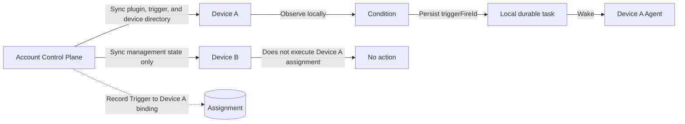
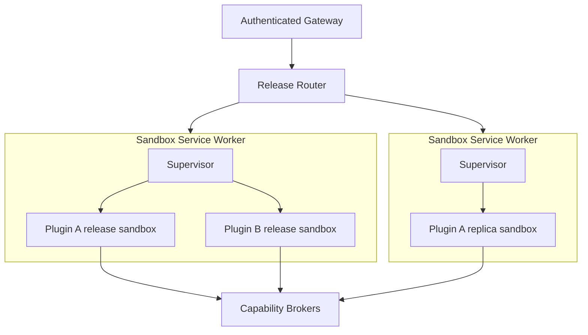

# Unified Plugin Platform and Cloud Plugin Security Boundaries

English | [中文](unified-plugin-platform.zh.md)

## Summary

This proposal makes a Cordis Plugin the only extension, installation, versioning, synchronization, activation, revocation, and review unit in DeepSeek Harness. Skills, tools, Client UI, Host services, triggers, providers, and cloud routes remain contributions of a plugin rather than becoming parallel product models. Personal Client and Host code may synchronize across a user's devices without platform code review, while every exact artifact that executes in the platform cloud requires human approval and a dedicated runtime security boundary.

The cloud authoring model is a complete TypeScript Hono application with platform-injected capabilities, not a single-request function or a Next.js application. A release may serve concurrent requests and may have multiple replicas, but it cannot access ambient credentials, other plugins, the host network, or durable state except through externally enforced brokers. The platform deliberately shares one release process across users of that plugin, so users of the same plugin are not isolated from its author or from the plugin's module memory.

## Table of Contents

- [Proposal status and terms](#proposal-status-and-terms)
- [One plugin model](#one-plugin-model)
- [Current repository foundation](#current-repository-foundation)
- [Release, signing, and review](#release-signing-and-review)
- [Cross-device installation and recovery](#cross-device-installation-and-recovery)
- [Device-bound triggers](#device-bound-triggers)
- [Cloud authoring with Hono](#cloud-authoring-with-hono)
- [Proposed author API](#proposed-author-api)
- [Identity and brokered capabilities](#identity-and-brokered-capabilities)
- [Cloud runtime, isolation, and scaling](#cloud-runtime-isolation-and-scaling)
- [Security guarantees and non-guarantees](#security-guarantees-and-non-guarantees)
- [Build and dependency policy](#build-and-dependency-policy)
- [Invocation, failure, and revocation](#invocation-failure-and-revocation)
- [Acceptance scenarios](#acceptance-scenarios)
- [Further Exploration](#further-exploration)
- [Dev Note](#dev-note)

-----

<a id="proposal-status-and-terms"></a>
## Proposal status and terms

This document separates current repository facts, proposed behavior, and guarantees that require future implementation and verification. A statement about the proposed platform is not a claim that the present API, Electrobun client, dynamic package runners, or sandbox prototype already provides that behavior.

The proposal uses these terms consistently:

| Term | Meaning |
|---|---|
| Plugin | The only installable and versioned extension unit; a plugin may contribute behavior to one or more runtimes |
| Plugin release | One immutable version record that binds target artifacts, metadata, compatibility, and ownership |
| Target | An execution location named `client`, `host`, or `cloud`, with its own artifact digest and entrypoint |
| Contribution | A skill, tool, UI slot, Host service, trigger, provider, or cloud route registered by a target |
| Installation | An account-level selection of one release plus synchronized non-secret configuration and enabled state |
| Device grant | Permission or credential that a specific device grants locally and that never follows the installation to another device |
| Cloud approval | A human decision over the exact cloud artifact, dependency closure, cloud manifest, permissions, and resource request digests |
| Invocation | One authenticated request pinned to one approved cloud release digest and one stable invocation identity |

The platform must not use “reviewed plugin” as an undifferentiated security label. A release that contains an unreviewed Client artifact and an approved Cloud artifact has two different trust decisions; the signature and catalog must expose that distinction.

-----

<a id="one-plugin-model"></a>
## One plugin model

DeepSeek Harness remains an all-plugin Cordis harness. Plugin is the only installation, versioning, synchronization, activation, revocation, and review unit. Skill, trigger, tool, and cloud service are contribution kinds, not independent application formats or parallel marketplaces.

| Contribution | Execution location | Human code review | Cross-device behavior |
|---|---|---|---|
| Client UI | User client | No | Synchronize artifact, ordinary configuration, and account-level enabled state |
| Host service or tool | User device Host | No | Synchronize artifact; do not inherit device permissions or credentials |
| Skill | Location selected by its owning plugin target | Only code that executes in the cloud | Synchronize with the owning plugin release |
| Trigger | One explicitly assigned user device | No | Synchronize definition and device assignment; never execute in the cloud |
| Cloud Hono application | Platform cloud | Yes | Deploy the approved digest in the cloud; do not download it as local executable code |
| Linked local and cloud contributions | Their respective locations | Only the cloud target | Allow local installation immediately; fail closed on cloud calls until cloud approval exists |

A plugin may contain only a skill, only a Client page, only a Host tool, only a Cloud Hono application, or any declared combination. Review follows where bytes execute, not whether the feature is called a skill, tool, provider, or trigger.

Every contribution continues to use Cordis lifecycle rules. Registration is an effect, every registry operation returns or owns a disposer, and unloading the target reverses all contributions made by that target. A contribution cannot silently create a second package identity or outlive its plugin release.

Skills remain files and providers loaded by the existing skill capability. A static skill may include instructions and supporting resources in its local artifact. If the skill calls a cloud tool, the cloud implementation and its declared capabilities belong to the cloud target's approval; the skill text itself does not become a separate “skill application” record.

-----

<a id="current-repository-foundation"></a>
## Current repository foundation

The current repository supplies useful lifecycle and protocol pieces, but it does not yet supply the complete platform described here.

| Current mechanism | Reusable fact | Limit that remains |
|---|---|---|
| Cordis composition and effects | Plugins register reversible services, events, and contributions | Cordis lifecycle does not isolate hostile code |
| Dynamic Host and Client runners | Immutable package versions and reversible activation are proven in one process | Registries are primarily process-local; `node:vm` is a cooperative development boundary |
| Skill registry, providers, and loader | Skills already enter the Agent through plugins | There is no account-level plugin release and synchronization service |
| WebWorker preview and workflow worker threads | Browser packaging and failure/lifecycle mechanics are proven | Web Workers and worker threads share authority that makes them unsuitable as cloud tenant isolation |
| `ctx.sandbox` filesystem capability | File effects can be redirected or constrained by a provider | It does not constrain network access, process visibility, kernel access, or another plugin's memory |
| Enterprise plugin API and Electrobun verifier | Publication records, digests, signatures, permission digests, review states, and revocation have partial implementations | The catalog does not yet install and activate a general plugin release, and the sandbox application does not execute submitted code |
| E2B providers | A capability provider can move filesystem and subprocess work into a remote environment | One provider integration does not define the required multi-tenant cloud runtime |

The proposed Cloud Sandbox Runtime is therefore a new security subsystem. It may reuse capability interfaces, artifact records, audit helpers, and provider patterns, but it must not describe the current unified sandbox adapter, `node:vm`, a Web Worker, or a worker thread as a cloud security boundary.

-----

<a id="release-signing-and-review"></a>
## Release, signing, and review

One opaque `PluginId` may have many immutable releases. A release binds its owner, version, compatibility, contribution metadata, and target descriptors, while each target owns an independent artifact digest. Installation and account synchronization select a release; execution and approval always resolve the exact target digest.

The release service stores at least these distinct records:

| Record | Required contents | Authority |
|---|---|---|
| Plugin identity | Opaque id, owner, visibility, and ownership history | Control plane |
| Plugin release | Version, target descriptors, compatibility, ordinary configuration schema, and release digest | Release service |
| Target artifact | Target kind, entrypoint, bytes, digest, build provenance, and platform signature | Artifact service |
| Cloud review input | Cloud artifact, complete dependency graph, SBOM, cloud manifest, permissions, routes, and requested resource ceilings | Controlled builder |
| Cloud approval | Every reviewed digest, reviewer, decision, conditions, policy revision, and time | Human reviewer through the control plane |
| Installation | Account, selected release, enabled state, synchronized ordinary configuration, and target status | Account control plane |
| Device grant | Account, device, plugin, local capability, local credential reference, and status | Device and local operating system |

Changing Client or Host bytes creates a new local target digest and never turns those bytes into “platform-approved code.” It does not require platform human code review. Changing cloud bytes, the dependency closure, cloud routes, capability requests, Secret declarations, or resource requests creates a new reviewed digest set; an earlier approval never transfers to that set.

For a linked release, the local targets can install and run before cloud approval. The gateway rejects every call to a missing, pending, rejected, or revoked cloud approval. The local UI must present that state explicitly instead of treating a local install as proof that the cloud service is available.

Platform signatures prove ownership attribution and byte integrity. They do not prove that local code is safe, that a reviewer found every defect, or that a cloud sandbox cannot be escaped. Automated format checks, malware scans, dependency alerts, and AI review may reduce risk, but none substitutes for the required human cloud approval or runtime enforcement.

Cloud revocation stops new admissions immediately. A severe revocation terminates active instances; a lower-severity revocation may drain already admitted calls under an explicit policy. A local revocation can stop future distribution and display a warning, but the platform cannot claim that it deleted code from an offline device.

-----

<a id="cross-device-installation-and-recovery"></a>
## Cross-device installation and recovery

Personal plugins use the account control plane for durability and discovery without turning the control plane into their execution environment.

1. The user creates, imports, or updates a plugin release.
2. The client uploads immutable target artifacts and their digests to account-owned object storage.
3. The release service records ownership, version, target descriptors, signatures, ordinary configuration, and account-level enabled state.
4. A newly authenticated device retrieves the account installation set.
5. The device verifies owner binding, platform signature, artifact digest, target compatibility, and declared runtime version before installation.
6. The device installs compatible Client and Host targets and restores their account-level enabled state.
7. A target that lacks a device permission, local credential, compatible runtime, or required operating-system feature remains installed but blocked.

The platform synchronizes artifacts, versions, non-secret configuration, enabled state, trigger definitions, and explicit trigger-to-device assignments. It does not synchronize operating-system permissions, Keychain entries, OAuth tokens, local path grants, accessibility permission, Shell authority, or local API keys. A new device must grant those permissions and credentials again.

Developer-owned cloud Secrets live in the platform Secret Service and are not part of a device package. End-user connections that require third-party credentials should remain broker-owned references; a cloud plugin does not receive the user's raw login token merely because the plugin is installed.

An incompatible device blocks only the affected target. It must not execute an undeclared fallback artifact, choose another target silently, or report the complete plugin as active when a required contribution is blocked.

This convenience has an explicit local risk. A Host plugin loaded into the current same-process Node Host is user-trusted code with the authority of that OS user. Cordis services, TypeScript types, manifest permissions, and UI prompts cannot stop it from directly importing Node APIs. Enforceable restrictions would require a separate Local Sandbox Runtime, which this proposal does not include in the cloud guarantees.

Account takeover can therefore distribute malicious local code to authenticated devices. A platform signature makes that distribution attributable and detects mutation in transit; it does not make the code benign. Automatic installation and enabled-state recovery deliberately accept this risk in exchange for cross-device continuity.

-----

<a id="device-bound-triggers"></a>
## Device-bound triggers

A trigger is a local contribution owned by a plugin. The platform has no trigger worker, cloud scheduler, or cloud Agent loop. The control plane synchronizes configuration and assignment, but only the assigned client evaluates time, files, prices, web responses, or other trigger conditions.

Each trigger instance binds to one stable `DeviceId` and may additionally bind to an Agent or preset on that device. A user may assign different trigger instances to different online devices. Other devices receive the synchronized definition for management and recovery UI, but they do not execute a trigger assigned elsewhere.

If the assigned device is offline, asleep, removed, or not running the client when an occurrence would happen, that occurrence is skipped. The platform creates no backlog, performs no catch-up, and does not migrate execution automatically. Removing a device changes its trigger assignments to unassigned and paused; the user must select another online device explicitly.

Calendar and interval triggers evaluate only time points reached while the local trigger runtime is active. State triggers such as a stock threshold or file change continue from the current observable state after startup and do not reconstruct an offline history. A manual reassignment also begins observation at the new device's current state.

After an online runtime detects an event, it writes a durable local task record with a stable `triggerFireId` before waking the local Agent. Crash recovery may resume that already recorded task under the same id. It must not manufacture a task for an event that no running device observed.

The trigger fire, selected Agent or preset, model-visible input, tool work, and final outcome must be reconstructable from Session events. Cross-device control messages record assignment and acknowledgement, but they never contain a hidden cloud execution path.



-----

<a id="cloud-authoring-with-hono"></a>
## Cloud authoring with Hono

The first cloud target supports TypeScript on a platform-pinned Node.js runtime and platform-pinned Hono version. The author exports one complete Hono application. The author does not listen on a port, configure TLS, select a process manager, or start an HTTP server.

The platform bootstrap imports the application, installs request context middleware, and serves it through a private Unix socket. The authenticated gateway maps the platform plugin path to the application route, enforces body and output limits, and never forwards the user's login token, Cookie, device credential, or platform Secret.

All routes in one cloud release share the module and service process. The process may handle multiple requests concurrently up to its resolved runtime specification. Horizontal scaling starts more instances of the same immutable release and balances admitted requests across them.

Module memory is ephemeral. It disappears on restart, diverges between replicas, and is visible to all users served by that process. Authors must use `dsh.storage` for durable state and `dsh.cache` for disposable shared data. Module variables cannot implement durable counters, cross-replica locks, user isolation, or exactly-once effects.

Every first-version cloud route requires platform authentication. Public routes, anonymous webhooks, custom ports, raw TCP listeners, background daemons, and an independently reachable service origin are outside this target.

This is service-style serverless: immutable builds, platform-owned ingress, bounded warm instances, cold starts, horizontal scaling, resource ceilings, metering, and failure replacement. Serverless does not imply one request per instance. The isolation unit is a plugin release process, not an individual Hono route or handler.

Next.js is intentionally absent. The cloud target is a constrained backend service, while Client UI remains a Client target that uses the existing slots and connection contracts. Next.js would add server rendering, static assets, framework build plugins, cache semantics, and a much larger dependency execution area. A future server-rendered target would require a separate API, sandbox profile, and review category rather than receiving Hono permissions implicitly.

-----

<a id="proposed-author-api"></a>
## Proposed author API

The following standalone TypeScript sketch defines the intended author concepts. It is a proposal, not an exported package in the current repository. Opaque identifiers become branded types in the implementation, manifests receive parser validation at ingestion, and runtime values are supplied by the platform rather than trusted from plugin input.

```ts
type PluginId = string & { readonly __brand: 'PluginId' }
type PluginReleaseId = string & { readonly __brand: 'PluginReleaseId' }
type CloudArtifactDigest = string & { readonly __brand: 'CloudArtifactDigest' }
type GlobalUserId = string & { readonly __brand: 'GlobalUserId' }
type DeviceId = string & { readonly __brand: 'DeviceId' }
type TriggerFireId = string & { readonly __brand: 'TriggerFireId' }
type AgentPresetId = string & { readonly __brand: 'AgentPresetId' }

interface PluginManifest {
  schemaVersion: 1
  id: PluginId
  version: string
  targets: PluginTargetManifest[]
}

type PluginTargetManifest = ClientTargetManifest | HostTargetManifest | CloudTargetManifest

interface ClientTargetManifest {
  kind: 'client'
  entry: string
  compatibility: string
  contributions: ClientContribution[]
}

interface HostTargetManifest {
  kind: 'host'
  entry: string
  compatibility: string
  contributions: HostContribution[]
}

interface CloudTargetManifest {
  kind: 'cloud'
  entry: string
  apiVersion: 1
  runtime: 'node-typescript'
  contributions: CloudContribution[]
  capabilities: CloudCapabilityRequest[]
  developerSecrets: DeveloperSecretDeclaration[]
  dependencies: Record<string, ExactPackageVersion>
  resources: CloudResourceRequest
}

type ClientContribution =
  | { kind: 'ui'; slot: string }
  | { kind: 'locale'; locale: string }

type HostContribution =
  | { kind: 'service'; name: string }
  | { kind: 'tool'; name: string }
  | { kind: 'skill'; path: string }
  | TriggerContribution

type CloudContribution =
  | { kind: 'route'; pathPrefix: string }
  | { kind: 'tool'; name: string; route: string }

interface TriggerContribution {
  kind: 'trigger'
  name: string
  configSchema: Record<string, unknown>
}

interface TriggerBinding {
  pluginId: PluginId
  triggerName: string
  deviceId: DeviceId | null
  agentPresetId?: AgentPresetId
  enabled: boolean
  config: unknown
}

type CloudCapabilityRequest =
  | { kind: 'model'; purposes: string[] }
  | { kind: 'http'; bindings: string[] }
  | { kind: 'storage'; scopes: Array<'user' | 'plugin'> }
  | { kind: 'cache'; namespace: string }
  | { kind: 'developer-secret'; names: string[] }
  | { kind: 'observability' }

interface DeveloperSecretDeclaration {
  name: string
  required: boolean
}

type ExactPackageVersion = string & { readonly __brand: 'ExactPackageVersion' }

interface CloudResourceRequest {
  cpuMillis: number
  memoryMiB: number
  pids: number
  timeoutMs: number
  temporaryStorageMiB: number
  cacheMiB: number
  maxConcurrency: number
  maxReplicas: number
  requestBytes: number
  responseBytes: number
}

interface CloudInvocation {
  invocationId: string
  attempt: number
  deadline: string
  traceId: string
  pluginId: PluginId
  releaseId: PluginReleaseId
  artifactDigest: CloudArtifactDigest
  userId: GlobalUserId
}

interface KeyValueStore {
  get(key: string): Promise<unknown>
  set(key: string, value: unknown): Promise<void>
  delete(key: string): Promise<void>
}

interface DshCloudContext {
  invocation: Readonly<CloudInvocation>
  model: { invoke(input: unknown): Promise<unknown> }
  http: { fetch(binding: string, request: Request): Promise<Response> }
  storage: { user: KeyValueStore; plugin: KeyValueStore }
  cache: KeyValueStore
  secrets: { read(name: string): Promise<string> }
  log: { write(level: 'debug' | 'info' | 'warn' | 'error', message: string): void }
  metrics: { increment(name: string, value?: number): void }
}

interface DshHonoEnv {
  Variables: { dsh: DshCloudContext }
}

interface HonoApplication<Env> {
  readonly env?: Env
  fetch(request: Request): Response | Promise<Response>
}

declare function definePlugin(manifest: PluginManifest): PluginManifest
declare function defineCloudApp(app: HonoApplication<DshHonoEnv>): HonoApplication<DshHonoEnv>

declare const app: HonoApplication<DshHonoEnv>

export const manifest = definePlugin({
  schemaVersion: 1,
  id: 'plugin_example' as PluginId,
  version: '1.0.0',
  targets: [],
})

export default defineCloudApp(app)
```

The production Hono binding exposes the request-scoped object as `c.var.dsh`. `definePlugin` validates author intent at build and ingestion time; it is not an authorization mechanism. The gateway, supervisor, and capability brokers derive invocation identity and effective permissions from signed release and admission records, never from `userId`, `pluginId`, or permission fields supplied by plugin code.

`CloudResourceRequest` expresses author needs. A separate resolver combines those requests with reviewer and deployment policy into an immutable effective runtime specification before execution. `run()` and request handlers must not hide deployment defaults or increase a resolved ceiling.

The cloud context intentionally has no Agent or trigger capability. A cloud route returns to the local caller; it cannot start a platform Agent loop or create cloud automation. The context also has no raw database connection, arbitrary URL fetch, process launcher, filesystem service, or queue unless a later reviewed capability adds one explicitly.

-----

<a id="identity-and-brokered-capabilities"></a>
## Identity and brokered capabilities

The cloud path uses three identities that must never collapse into one token:

| Identity | Purpose | Plugin-visible data |
|---|---|---|
| End-user identity | Authenticate the caller and authorize installation, entitlement, organization policy, and route access | A platform-global opaque user id and approved request context; never the login token or Cookie |
| Plugin runtime identity | Authorize one admitted release instance and its broker calls | Short-lived invocation and process authority bound to the approved plugin, digest, user, deadline, and capabilities |
| Developer resource identity | Charge platform model use and developer-owned services | Broker result and usage metadata; never the platform model credential |

The selected global user id lets the same plugin recognize one account across devices and organizations where policy permits. It also lets different plugins correlate the same account if the value is exposed unchanged. This is an accepted privacy cost of the selected identity model and must be disclosed; a per-plugin pseudonym would be a different design.

`dsh.model` calls the Model Gateway under the plugin developer's resource account, quotas, and billing policy. The final user's provider key and model credential never enter the sandbox. The Model Gateway holds provider credentials and returns only the model result and permitted usage information.

`dsh.http` accepts a named reviewed binding rather than arbitrary network authority. The egress broker resolves DNS, enforces domain, method, port, byte, redirect, and deadline policy, protects against DNS rebinding, records the decision, and returns a size-limited response. The sandbox has no direct external or private-network route.

`dsh.storage.user` is physically namespaced by plugin and global user id. `dsh.storage.plugin` is shared by all users of the plugin and must be requested deliberately. The broker binds both namespaces from the invocation record; a plugin-supplied key cannot escape into another plugin's namespace.

`dsh.cache` is release-scoped, quota-limited, disposable, and subject to TTL and least-recently-used eviction. A plugin cannot rely on cache survival for correctness. Temporary filesystem data receives a separate per-instance or per-invocation quota and is cleared at lifecycle end; the cache and `/tmp` are not durable storage.

Developer Secrets belong to the plugin developer, not the end user. `dsh.secrets.read()` deliberately returns the declared plaintext to approved plugin code for the current invocation. After delivery, the platform cannot prevent the plugin from logging, persisting, returning, or exfiltrating that value through another approved capability. Review, redaction, rotation, egress policy, and least privilege reduce this risk but do not create secrecy from the plugin itself.

Capability objects may be frozen and hidden from ordinary enumeration for ergonomics, but JavaScript object hardening and TypeScript types are not authorization boundaries. Every broker authenticates the caller through supervisor-provisioned channels and re-authorizes the exact operation against the signed approval record.

-----

<a id="cloud-runtime-isolation-and-scaling"></a>
## Cloud runtime, isolation, and scaling

The deployment contains multiple Sandbox Service workers. Each worker has a supervisor that fetches verified artifacts, creates release sandboxes, proxies private Unix sockets, reports health, and enforces the resolved runtime specification. One worker may host many plugins only when each plugin release receives an independent operating-system sandbox.



Docker may package or deploy a Sandbox Service worker, but the outer container does not isolate plugin processes from one another. The supervisor must create an independent process security domain for every release through a dedicated sandbox runtime. A production implementation may use OCI namespaces with a hardened runtime, gVisor, Kata, or a microVM tier; the implementation must prove the guarantees below rather than treating the product name as evidence.

Every release sandbox requires at least:

- a dedicated process and unprivileged UID/GID;
- independent mount, PID, IPC, and network namespaces;
- a read-only application and dependency mount;
- a private, quota-limited temporary filesystem and separately managed disposable cache;
- a cgroup for CPU, memory, process count, and I/O accounting and ceilings;
- `no_new_privs`, a minimal seccomp profile, and no ambient Linux capabilities;
- no Docker socket, host Secret, package-manager credential, broad host mount, or peer sandbox socket;
- no direct public internet, private network, metadata service, or control-plane route;
- a private application socket and authenticated broker channels provisioned only for that release;
- deadline, request, response, log, file, file-descriptor, connection, and child-process ceilings; and
- termination semantics in which an OOM, crash, timeout, or malformed response kills or replaces only the affected release instance.

The router admits a request only after resolving the approved digest and effective runtime specification. It can direct concurrent requests to one healthy Hono instance until `maxConcurrency`, queue capacity, or another limit is reached, then use another replica or reject the request with a classified overload result. Autoscaling uses admitted concurrency, queue delay, CPU, memory, latency, and error signals within approved replica and budget ceilings.

Scaling a release creates more copies of the same isolation domain; it does not widen capabilities or load a newer digest. Rollout preloads and health-checks an approved candidate, sends a bounded canary, moves new traffic atomically, and preserves the previous approved digest for explicit rollback. Rollback changes routing, never artifact bytes.

The supervisor, gateway, broker, controlled builder, artifact store, container or microVM runtime, and host kernel are part of the trusted computing base. The supervisor itself must not receive a Docker socket or broad host credentials merely to simplify orchestration. Compromise of the host kernel, sandbox runtime, supervisor, broker, or signing authority can invalidate multiple plugin boundaries and requires platform incident response.

-----

<a id="security-guarantees-and-non-guarantees"></a>
## Security guarantees and non-guarantees

The design places its strongest enforceable boundary between different plugin releases. It does not place a process or module-memory boundary between users of the same approved release.

| Boundary | Enforced by | Intended guarantee | Explicit non-guarantee |
|---|---|---|---|
| Artifact storage to device | Digest, owner binding, and platform signature | Detect mutation and wrong-owner installation | Code safety or protection after account takeover |
| Local plugin to device | User trust and OS prompts in the current design | Make local authority visible and re-request device grants | Containment of same-process Host code |
| User to gateway | Authentication, entitlement, policy, and request limits | Reject unauthenticated and unauthorized cloud calls | Hide the platform-global user id from the selected plugin |
| Gateway to release | Digest-pinned routing and invocation identity | Route only to the exact approved cloud release | Make an approved malicious plugin trustworthy |
| Plugin release to another release | OS sandbox, filesystem separation, network denial, cgroups, and broker authorization | Prevent ordinary code and resource failures from reaching peer releases | Survive a kernel, supervisor, broker, or sandbox-runtime compromise |
| Plugin to platform capability | Authenticated broker channel and per-operation authorization | Restrict each operation to reviewed capabilities and invocation identity | Make frozen JavaScript objects or TypeScript types enforce security |
| Plugin to external network | Network namespace and egress broker | Deny direct egress and apply named binding policy | Prevent exfiltration through an explicitly approved destination |
| One user to another user of the same plugin | Request context and storage namespaces | Give well-behaved code the correct user namespace | Process-level, module-memory, or author-level isolation |
| Plugin to developer Secret | Review, named declaration, audit, and broker release | Return only a declared developer Secret to the approved release | Keep plaintext secret from that release after delivery |
| Release to host resources | Read-only mounts, minimal process authority, quotas, and syscall policy | Bound ordinary filesystem and resource access | Absolute containment against unknown kernel vulnerabilities |

One Hono release process may handle requests from several accounts. Its author receives the request data intentionally exposed to the plugin, the platform-global user id, and any capability results. Malicious code can retain data in module variables or shared plugin storage and correlate users. Storage namespacing protects cooperative code from accidental key overlap; it cannot force a hostile program in the same process to forget data it has already seen.

This is the trust model of a shared SaaS service authored by the plugin developer. A plugin that requires mutually distrusting users to have process-level isolation needs a separate per-user or per-tenant deployment class, which is not part of this first target.

Review catches known and visible risks but is not a runtime boundary. Static import checks, dependency allowlists, AI findings, human review, Hono middleware, SDK restrictions, and JavaScript hardening are defense-in-depth controls. The OS sandbox, broker authorization, credential separation, and digest-pinned routing enforce the runtime decision.

-----

<a id="build-and-dependency-policy"></a>
## Build and dependency policy

Cloud dependencies install only in an isolated controlled build. The runtime contains no package manager credentials and cannot run `npm install`, fetch a missing package, compile a native extension, or resolve a newer semver range.

The initial policy admits only administrator-approved packages. An allowlist entry binds package name, exact version, registry origin, tarball integrity, license decision, and the complete transitive dependency graph. Git URLs, local paths, arbitrary registries, floating ranges, undeclared dynamic imports, and post-install downloads are rejected.

Install scripts and native addons are prohibited in the first class. Supporting either requires a distinct build and review category because they execute code during build or expand the runtime ABI and syscall area. Hono and the DSH cloud author package are pinned by the platform instead of supplied as unconstrained plugin dependencies.

The builder starts from a digest-pinned base image, uses an approved registry proxy, rejects prohibited Node built-ins and unresolved dynamic loading, scans source and the dependency closure, creates an SBOM, and emits a deterministic artifact, lockfile digest, dependency-graph digest, and build provenance. The exact outputs enter the human review record.

The runtime process starts with a sanitized empty application environment. `process.env` is unsupported as plugin configuration and contains no platform, host, user, model, or Secret credentials. Authors receive fixed request data and capabilities through `c.var.dsh`. Build-time checks may reject ambient process access, but the absence of valuable environment data and the OS sandbox remain the security controls if code bypasses that check.

Code and dependencies mount read-only. A writable temporary area is quota-limited and cleared; a cache area is quota-limited and evictable. Exceeding a temporary or cache limit rejects the write or evicts eligible cache content according to platform policy, never expands the mount or writes into another release.

-----

<a id="invocation-failure-and-revocation"></a>
## Invocation, failure, and revocation

The gateway authenticates the user, resolves installation and entitlement, verifies cloud approval and policy revision, admits quota, and creates the invocation envelope. It forwards a bounded HTTP request to the release socket without forwarding the caller's credential. The supervisor and broker bind the envelope to the running process; plugin-supplied identity fields are ignored.

Every call carries a stable invocation id, artifact digest, attempt, deadline, trace id, and optional idempotency key. Automatic retry is allowed only when the approved route and every brokered side effect are idempotent for that key. A timed-out non-idempotent operation returns an indeterminate outcome and is not retried blindly.

The platform distinguishes admission refusal, authentication failure, capability denial, dependency or configuration failure, overload, deadline, plugin response error, plugin crash, OOM termination, and platform failure. Each class has a stable user-facing result and an audit event. Plugin stack traces and Secret values are redacted from end-user and cross-tenant views.

A process crash fails all concurrent calls in that instance because the Hono routes share one process. The router can replace the instance and continue using healthy replicas of the same release. The crash must not stop another plugin's pool, expose peer memory, or route a retry to a different digest.

Revocation checks occur at admission and capability use. New calls fail immediately after revocation. A broker refuses further operations from a revoked invocation even if a stale sandbox remains alive. Emergency policy terminates instances and closes sockets; ordinary rollback and low-severity revocation may drain calls only when policy explicitly permits it.

Audit and metering records attribute admission, routing, instance, capability decision, measured CPU and memory time, storage, egress, model use, response class, and revocation outcome to the user, developer resource account, plugin release, artifact digest, invocation, and trace. Content is excluded by default and follows an explicit redaction and retention policy.

-----

<a id="acceptance-scenarios"></a>
## Acceptance scenarios

The proposal is not complete until implementations and tests demonstrate these outcomes:

1. A user creates a Client/Host plugin on Device A, signs it into the account, and Device B installs the exact artifact and ordinary configuration without platform human review; Device B remains blocked until its own local grants and credentials are supplied.
2. A linked plugin installs its local target while its cloud review is pending, and every cloud request fails closed without sending user credentials or request content to an unapproved process.
3. Changing one reviewed cloud byte, dependency, route, capability, Secret declaration, or resource request produces new digests that cannot inherit the prior approval.
4. A trigger assigned to Device A never executes on Device B; an occurrence while Device A is offline is skipped; deletion of Device A pauses the assignment; manual reassignment starts from the new device's current state.
5. A detected online trigger persists one `triggerFireId` before Agent work, and crash recovery resumes that recorded fire without inventing missed offline fires.
6. One Hono instance handles bounded concurrent calls, a second replica scales out under load, and both remain pinned to one digest while module memory is treated as ephemeral.
7. A plugin cannot read host environment credentials, another release's files, process list, socket, cache, temporary files, or storage namespace, and cannot reach the public internet or private network directly.
8. Broker tests prove that forged user, plugin, tenant, capability, or digest fields cannot change the identity bound by gateway and supervisor admission.
9. CPU exhaustion, memory exhaustion, process explosion, oversized output, timeout, malformed response, and crash terminate or reject only the affected release instance and produce classified audit records.
10. The developer's model use is charged to the developer resource identity, while the end-user credential remains in the gateway and never appears in environment, logs, plugin input, or broker output.
11. A declared developer Secret reaches approved code as plaintext and the product disclosure states that the plugin can retain or leak it; redaction and egress controls do not claim otherwise.
12. Requests from two users may share one release process, and tests verify storage namespace routing while documentation and UI do not claim process or author isolation between those users.
13. Revocation blocks new admission and broker access immediately, emergency termination removes live instances, and rollback selects a previously approved digest without mutating either artifact.
14. Account takeover and local Host authority appear in threat modeling and user warnings; signature verification is never presented as local code safety certification.

-----

<a id="further-exploration"></a>
## Further Exploration

- [Enterprise Agent platform blueprint](enterprise-agent-platform.md) — broader identity, runtime, governance, billing, and delivery architecture.
- [Enterprise plugin model](../../enterprise-plugins.md) — current implemented publication and client verification facts.
- [DeepSeek Harness architecture](../../architecture.md) — current Cordis composition, Agent loop, Session log, and capability seams.
- [Sandbox subsystem](../../subsystems/sandbox.md) — current filesystem sandbox capability and its limits.
- [Schedule subsystem](../../subsystems/schedule.md) — current local scheduling types and lifecycle.
- [Skills subsystem](../../subsystems/skills.md) — current skill registry, provider, catalog, and loader behavior.
- [Dynamic Cordis Host runner](../../../packages/extensions/cordis-host-runner/README.md) — current immutable in-process package lifecycle and its trust boundary.

-----

<a id="dev-note"></a>
## Dev Note

This page records a proposed product and security design. Exact wire schemas, storage migrations, package APIs, Linux sandbox technology, and deployment configuration remain implementation decisions that must satisfy the stated guarantees and acceptance scenarios; none is shipped by this document.
