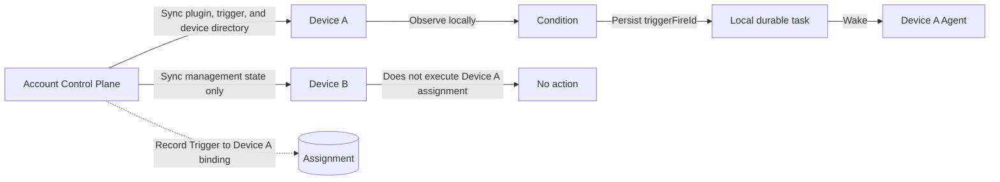
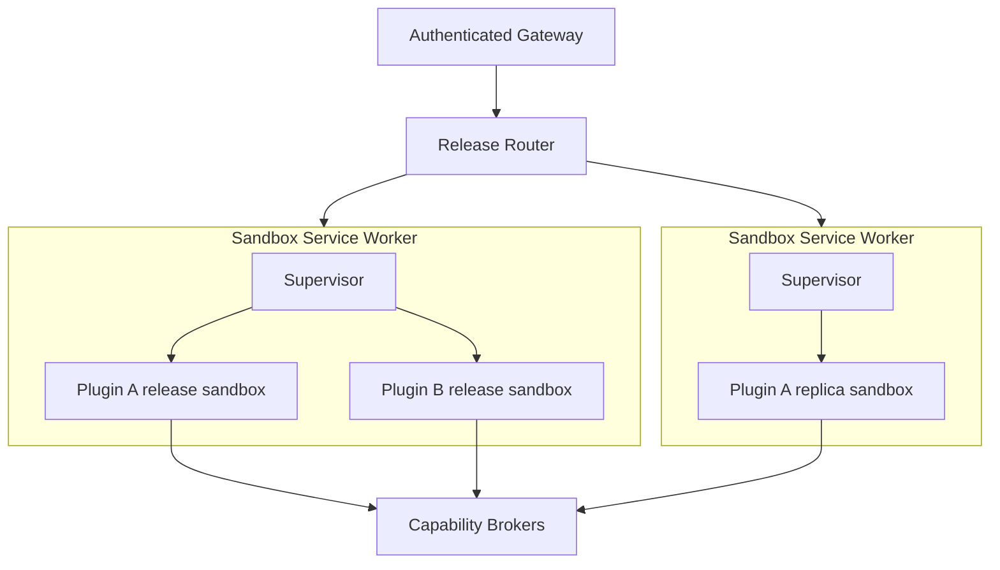

# 统一插件平台与云端插件安全边界

[English](unified-plugin-platform.md) | 中文

## 摘要

本提案将 Cordis 插件设为 DeepSeek Harness 唯一的扩展、安装、版本、同步、启用、撤销和审核单位。skill（技能）、工具、Client UI、Host 服务、触发器、提供方和云端路由继续作为插件的 contribution（贡献），而不会形成并行的产品模型。个人 Client 和 Host 代码无需平台代码审核即可在用户设备间同步，而进入平台云端执行的每个精确产物都必须经过人工批准，并拥有专门的运行时安全边界。

云端作者模型是通过平台注入能力的完整 TypeScript Hono 应用，而不是单请求函数或 Next.js 应用。一个版本可以并发处理请求并拥有多个副本，但只能通过外部强制执行的代理访问凭据、其他插件、宿主网络和持久状态。平台明确让同一插件的用户共享一个版本进程，因此同一插件的用户不会与插件作者或插件模块内存隔离。

## 目录

- [提案状态与术语](#proposal-status-and-terms)
- [统一插件模型](#one-plugin-model)
- [当前仓库基础](#current-repository-foundation)
- [版本、签名与审核](#release-signing-and-review)
- [跨设备安装与恢复](#cross-device-installation-and-recovery)
- [设备绑定触发器](#device-bound-triggers)
- [使用 Hono 编写云端插件](#cloud-authoring-with-hono)
- [提议的作者 API](#proposed-author-api)
- [身份与受代理能力](#identity-and-brokered-capabilities)
- [云端运行时、隔离与扩缩容](#cloud-runtime-isolation-and-scaling)
- [安全保证与非保证](#security-guarantees-and-non-guarantees)
- [构建与依赖策略](#build-and-dependency-policy)
- [调用、故障与撤销](#invocation-failure-and-revocation)
- [验收场景](#acceptance-scenarios)
- [延伸阅读](#further-exploration)
- [开发备注](#dev-note)

-----

<a id="proposal-status-and-terms"></a>
## 提案状态与术语

本文区分当前仓库事实、提议行为，以及必须由未来实现和验证才能成立的保证。提案中的平台描述不代表当前 API、Electrobun 客户端、动态包 Runner 或沙箱原型已经提供相应行为。

本提案统一使用以下术语：

| 术语 | 含义 |
|---|---|
| 插件 | 唯一可安装且可版本化的扩展单位；一个插件可以向一个或多个运行时贡献行为 |
| 插件版本 | 绑定目标产物、元数据、兼容性和所有权的不可变版本记录 |
| 目标 | 名为 `client`、`host` 或 `cloud` 的执行位置，各自拥有产物摘要和入口点 |
| contribution | 目标注册的 skill、工具、UI slot、Host 服务、触发器、提供方或云端路由 |
| 安装记录 | 账号级选择的一个版本，以及同步的非秘密配置和启用状态 |
| 设备授权 | 具体设备在本地授予且绝不随安装记录迁移到其他设备的权限或凭据 |
| 云端批准 | 人工对精确云端产物、依赖闭包、云端 manifest、权限和资源请求摘要作出的决定 |
| 调用 | 固定到一个获批云端版本摘要和一个稳定调用身份的认证请求 |

平台不得把“已审核插件”用作不区分目标的安全标签。一个包含未审核 Client 产物和已批准 Cloud 产物的版本具有两个不同的信任决定；签名和目录必须暴露这种区别。

-----

<a id="one-plugin-model"></a>
## 统一插件模型

DeepSeek Harness 继续采用“万物皆插件”的 Cordis harness。插件是唯一的安装、版本、同步、启用、撤销和审核单位。skill、触发器、工具和云端服务是 contribution 类型，而不是独立应用格式或并行市场。

| Contribution | 执行位置 | 人工代码审核 | 跨设备行为 |
|---|---|---|---|
| Client UI | 用户客户端 | 否 | 同步产物、普通配置和账号级启用状态 |
| Host 服务或工具 | 用户设备 Host | 否 | 同步产物；不继承设备权限或凭据 |
| Skill | 由所属插件目标选择的位置 | 只审核进入云端执行的代码 | 随所属插件版本同步 |
| Trigger | 一台显式指定的用户设备 | 否 | 同步定义和设备分配；绝不在云端执行 |
| Cloud Hono 应用 | 平台云端 | 是 | 在云端部署获批摘要；不把它下载为本地可执行代码 |
| 本地与云端联动 contribution | 各自的位置 | 只审核 Cloud target | 允许立即本地安装；在云端获批前使云端调用快速失败 |

插件可以只包含一个 skill、一个 Client 页面、一个 Host 工具、一个 Cloud Hono 应用，也可以包含任何已声明组合。审核取决于字节在哪里执行，而不取决于功能被称为 skill、工具、提供方还是触发器。

每项 contribution 继续遵守 Cordis 生命周期规则。注册属于 effect（副作用），每项注册表操作返回或拥有 disposer（资源释放器），卸载目标会撤销该目标做出的所有 contribution。Contribution 不能静默创建第二个包身份，也不能比所属插件版本存活更久。

Skill 继续作为文件和提供方通过现有 skill 能力加载。静态 skill 可以在本地产物中包含指令和辅助资源。如果 skill 调用云端工具，云端实现及其声明能力属于 Cloud target 的批准范围；skill 文本本身不会成为独立的“技能应用”记录。

-----

<a id="current-repository-foundation"></a>
## 当前仓库基础

当前仓库提供有用的生命周期和协议组件，但尚未提供本文描述的完整平台。

| 当前机制 | 可复用事实 | 仍然存在的限制 |
|---|---|---|
| Cordis 组合与 effect | 插件注册可逆的服务、事件和 contribution | Cordis 生命周期不能隔离恶意代码 |
| 动态 Host 与 Client Runner | 已在一个进程中证明不可变包版本和可逆启用 | 注册表主要存在于进程内；`node:vm` 是协作式开发边界 |
| Skill 注册表、提供方和 loader | Skill 已经通过插件进入 agent | 尚无账号级插件版本与同步服务 |
| WebWorker 预览和工作流 worker thread | 已证明浏览器打包以及故障／生命周期机制 | Web Worker 和 worker thread 共享的权限使其不适合作为云租户隔离 |
| `ctx.sandbox` 文件系统能力 | Provider 可以重定向或约束文件 effect | 它不约束网络访问、进程可见性、内核访问或其他插件的内存 |
| 企业插件 API 与 Electrobun 校验器 | 发布记录、摘要、签名、权限摘要、审核状态和撤销已有部分实现 | 目录尚不能安装和启用通用插件版本，沙箱应用也不执行提交的代码 |
| E2B Provider | 能力 Provider 可以把文件系统和子进程工作移入远程环境 | 单个 Provider 集成不能定义所需的多租户云端运行时 |

因此，提议的 Cloud Sandbox Runtime 是新的安全子系统。它可以复用能力接口、产物记录、审计辅助程序和 Provider 模式，但不得把当前统一沙箱适配器、`node:vm`、Web Worker 或 worker thread 描述为云端安全边界。

-----

<a id="release-signing-and-review"></a>
## 版本、签名与审核

一个不透明 `PluginId` 可以拥有多个不可变版本。版本绑定所有者、版本号、兼容性、contribution 元数据和目标描述符，而每个目标拥有独立的产物摘要。安装和账号同步选择插件版本；执行和批准始终解析精确目标摘要。

版本服务至少保存以下不同记录：

| 记录 | 必需内容 | 权威方 |
|---|---|---|
| 插件身份 | 不透明 id、所有者、可见性和所有权历史 | 控制平面 |
| 插件版本 | 版本号、目标描述符、兼容性、普通配置 schema 和版本摘要 | 版本服务 |
| 目标产物 | 目标类型、入口点、字节、摘要、构建来源和平台签名 | 产物服务 |
| 云端审核输入 | 云端产物、完整依赖图、SBOM、云端 manifest、权限、路由和请求的资源上限 | 受控构建器 |
| 云端批准 | 每个已审核摘要、审核者、决定、条件、策略版本和时间 | 通过控制平面的人工审核者 |
| 安装记录 | 账号、所选版本、启用状态、同步的普通配置和目标状态 | 账号控制平面 |
| 设备授权 | 账号、设备、插件、本地能力、本地凭据引用和状态 | 设备与本地操作系统 |

改变 Client 或 Host 字节会产生新的本地目标摘要，并且绝不会让这些字节变成“平台批准代码”。这不需要平台人工代码审核。改变云端字节、依赖闭包、云端路由、能力请求、Secret 声明或资源请求会产生新的待审核摘要集合；先前批准绝不转移到该集合。

对于联动版本，本地目标可以在云端批准前安装和运行。网关拒绝所有指向缺失、待处理、被拒绝或被撤销云端批准的调用。本地 UI 必须显式显示该状态，不得把本地安装视为云端服务可用的证明。

平台签名证明所有权归属和字节完整性。它不证明本地代码安全，不证明审核者发现了所有缺陷，也不证明云端沙箱无法逃逸。自动格式检查、恶意软件扫描、依赖告警和 AI 审核可以降低风险，但都不能替代必需的人工云端批准或运行时强制措施。

云端撤销会立即停止接纳新调用。严重撤销会终止活动实例；较低严重度的撤销可以按照显式策略排空已接纳调用。本地撤销可以停止后续分发并显示警告，但平台不能声称已从离线设备删除代码。

-----

<a id="cross-device-installation-and-recovery"></a>
## 跨设备安装与恢复

个人插件使用账号控制平面实现持久化和发现，但不会让控制平面成为其执行环境。

1. 用户创建、导入或更新一个插件版本。
2. 客户端把不可变目标产物及其摘要上传到账号所有的对象存储。
3. 版本服务记录所有权、版本号、目标描述符、签名、普通配置和账号级启用状态。
4. 新认证设备获取账号安装集合。
5. 设备在安装前校验所有者绑定、平台签名、产物摘要、目标兼容性和声明的运行时版本。
6. 设备安装兼容的 Client 和 Host 目标，并恢复其账号级启用状态。
7. 缺少设备权限、本地凭据、兼容运行时或必需操作系统功能的目标保持已安装但阻塞状态。

平台同步产物、版本、非秘密配置、启用状态、触发器定义和显式的触发器到设备分配。它不操作系统权限、Keychain 条目、OAuth token、本地路径授权、辅助功能权限、Shell 权限或本地 API 密钥。新设备必须重新授予这些权限和凭据。

开发者拥有的云端 Secret 位于平台 Secret Service，不属于设备包。需要第三方凭据的最终用户连接应继续使用由代理持有的引用；云端插件不会仅因已安装就获得用户的原始登录 token。

不兼容设备只阻塞受影响目标。它不得执行未声明的后备产物、静默选择其他目标，也不得在必需 contribution 被阻塞时把完整插件报告为活动状态。

这种便利性具有明确的本地风险。加载到当前同进程 Node Host 的 Host 插件，是由用户信任且拥有该 OS 用户权限的代码。Cordis Service、TypeScript 类型、manifest 权限和 UI 提示都不能阻止它直接导入 Node API。可强制执行的限制需要独立的 Local Sandbox Runtime，而本提案不会把它纳入云端保证。

因此，账号接管可以向已认证设备分发恶意本地代码。平台签名让该分发可归属并检测传输中的变更；它不能使代码变得安全。自动安装和启用状态恢复明确接受这项风险，以换取跨设备连续性。

-----

<a id="device-bound-triggers"></a>
## 设备绑定触发器

触发器是插件拥有的本地 contribution。平台没有触发器 worker、云端调度器或云端 agent loop。控制平面同步配置和分配，但只有被分配的客户端评估时间、文件、价格、Web 响应或其他触发条件。

每个触发器实例绑定一个稳定 `DeviceId`，还可以绑定该设备上的 agent 或 preset。用户可以把不同触发器实例分配给不同在线设备。其他设备接收同步定义，以用于管理与恢复 UI，但不会执行分配给其他设备的触发器。

如果被分配设备在事件本应发生时处于离线、休眠、已删除或未运行客户端状态，该事件会被跳过。平台不创建 backlog、不执行补偿，也不自动迁移执行。删除设备会把相关触发器分配改成未分配和暂停；用户必须显式选择另一台在线设备。

日历和间隔触发器只评估本地触发器运行时活动期间到达的时间点。股票阈值或文件变化等状态触发器会在启动后从当前可观察状态继续，并且不会重建离线历史。手动重新分配也会从新设备的当前状态开始观察。

在线运行时检测到事件后，会先用稳定 `triggerFireId` 写入持久本地任务记录，再唤醒本地 agent。崩溃恢复可以使用同一个 id 恢复该已记录任务。它不得为没有运行设备观察到的事件制造任务。

触发器触发、所选 agent 或 preset、模型可见输入、工具工作和最终结果都必须能通过会话事件重建。跨设备控制消息记录分配和确认，但绝不包含隐藏的云端执行路径。



-----

<a id="cloud-authoring-with-hono"></a>
## 使用 Hono 编写云端插件

首个云端目标支持平台锁定版本的 Node.js 运行时和 Hono 上的 TypeScript。作者导出一个完整 Hono 应用。作者不监听端口、不配置 TLS、不选择进程管理器，也不启动 HTTP 服务器。

平台 bootstrap 导入应用、安装请求上下文中间件，并通过私有 Unix socket 对外提供服务。认证网关把平台插件路径映射到应用路由、强制请求体和输出限制，并且绝不转发用户登录 token、Cookie、设备凭据或平台 Secret。

一个云端版本中的所有路由共享模块和服务进程。进程可以并发处理多个请求，直到达到解析后的运行时规格。水平扩容会启动同一不可变版本的更多实例，并在它们之间均衡已接纳请求。

模块内存是临时的。它在重启时消失，在副本间分叉，并对该进程服务的所有用户可见。作者必须使用 `dsh.storage` 保存持久状态，并使用 `dsh.cache` 保存可丢弃共享数据。模块变量不能实现持久计数器、跨副本锁、用户隔离或恰好一次副作用。

第一版中的每条云端路由都需要平台认证。公共路由、匿名 webhook、自定义端口、原始 TCP 监听器、后台守护进程和可独立访问的服务 origin 不属于该目标。

这是 service-style serverless（服务式无服务器）：不可变构建、平台所有的入口、有界热实例、冷启动、水平扩容、资源上限、计量和故障替换。Serverless 不代表每个实例只能处理一个请求。隔离单位是插件版本进程，不是单条 Hono 路由或处理函数。

第一版有意不提供 Next.js。云端目标是受约束的后端服务，Client UI 则继续作为 Client target 使用现有 slot 和连接约定。Next.js 会增加服务端渲染、静态资源、框架构建插件、缓存语义和更大的依赖执行面。未来的服务端渲染目标需要独立的 API、沙箱配置和审核类别，而不能隐式获得 Hono 权限。

-----

<a id="proposed-author-api"></a>
## 提议的作者 API

以下独立 TypeScript 草案定义预期的作者概念。它是一项提案，不是当前仓库已导出的包。实现会把不透明标识符变成品牌类型，在输入时用解析器校验 manifest，并由平台提供运行时值，而不信任插件输入。

```ts
type PluginId = string & { readonly __brand: 'PluginId' }
type PluginReleaseId = string & { readonly __brand: 'PluginReleaseId' }
type CloudArtifactDigest = string & { readonly __brand: 'CloudArtifactDigest' }
type GlobalUserId = string & { readonly __brand: 'GlobalUserId' }
type DeviceId = string & { readonly __brand: 'DeviceId' }
type TriggerFireId = string & { readonly __brand: 'TriggerFireId' }
type AgentPresetId = string & { readonly __brand: 'AgentPresetId' }

interface PluginManifest {
  schemaVersion: 1
  id: PluginId
  version: string
  targets: PluginTargetManifest[]
}

type PluginTargetManifest = ClientTargetManifest | HostTargetManifest | CloudTargetManifest

interface ClientTargetManifest {
  kind: 'client'
  entry: string
  compatibility: string
  contributions: ClientContribution[]
}

interface HostTargetManifest {
  kind: 'host'
  entry: string
  compatibility: string
  contributions: HostContribution[]
}

interface CloudTargetManifest {
  kind: 'cloud'
  entry: string
  apiVersion: 1
  runtime: 'node-typescript'
  contributions: CloudContribution[]
  capabilities: CloudCapabilityRequest[]
  developerSecrets: DeveloperSecretDeclaration[]
  dependencies: Record<string, ExactPackageVersion>
  resources: CloudResourceRequest
}

type ClientContribution =
  | { kind: 'ui'; slot: string }
  | { kind: 'locale'; locale: string }

type HostContribution =
  | { kind: 'service'; name: string }
  | { kind: 'tool'; name: string }
  | { kind: 'skill'; path: string }
  | TriggerContribution

type CloudContribution =
  | { kind: 'route'; pathPrefix: string }
  | { kind: 'tool'; name: string; route: string }

interface TriggerContribution {
  kind: 'trigger'
  name: string
  configSchema: Record<string, unknown>
}

interface TriggerBinding {
  pluginId: PluginId
  triggerName: string
  deviceId: DeviceId | null
  agentPresetId?: AgentPresetId
  enabled: boolean
  config: unknown
}

type CloudCapabilityRequest =
  | { kind: 'model'; purposes: string[] }
  | { kind: 'http'; bindings: string[] }
  | { kind: 'storage'; scopes: Array<'user' | 'plugin'> }
  | { kind: 'cache'; namespace: string }
  | { kind: 'developer-secret'; names: string[] }
  | { kind: 'observability' }

interface DeveloperSecretDeclaration {
  name: string
  required: boolean
}

type ExactPackageVersion = string & { readonly __brand: 'ExactPackageVersion' }

interface CloudResourceRequest {
  cpuMillis: number
  memoryMiB: number
  pids: number
  timeoutMs: number
  temporaryStorageMiB: number
  cacheMiB: number
  maxConcurrency: number
  maxReplicas: number
  requestBytes: number
  responseBytes: number
}

interface CloudInvocation {
  invocationId: string
  attempt: number
  deadline: string
  traceId: string
  pluginId: PluginId
  releaseId: PluginReleaseId
  artifactDigest: CloudArtifactDigest
  userId: GlobalUserId
}

interface KeyValueStore {
  get(key: string): Promise<unknown>
  set(key: string, value: unknown): Promise<void>
  delete(key: string): Promise<void>
}

interface DshCloudContext {
  invocation: Readonly<CloudInvocation>
  model: { invoke(input: unknown): Promise<unknown> }
  http: { fetch(binding: string, request: Request): Promise<Response> }
  storage: { user: KeyValueStore; plugin: KeyValueStore }
  cache: KeyValueStore
  secrets: { read(name: string): Promise<string> }
  log: { write(level: 'debug' | 'info' | 'warn' | 'error', message: string): void }
  metrics: { increment(name: string, value?: number): void }
}

interface DshHonoEnv {
  Variables: { dsh: DshCloudContext }
}

interface HonoApplication<Env> {
  readonly env?: Env
  fetch(request: Request): Response | Promise<Response>
}

declare function definePlugin(manifest: PluginManifest): PluginManifest
declare function defineCloudApp(app: HonoApplication<DshHonoEnv>): HonoApplication<DshHonoEnv>

declare const app: HonoApplication<DshHonoEnv>

export const manifest = definePlugin({
  schemaVersion: 1,
  id: 'plugin_example' as PluginId,
  version: '1.0.0',
  targets: [],
})

export default defineCloudApp(app)
```

生产 Hono 绑定通过 `c.var.dsh` 暴露请求作用域对象。`definePlugin` 在构建和输入时校验作者意图；它不是授权机制。网关、supervisor 和能力代理从已签名版本与接纳记录推导调用身份和有效权限，绝不使用插件代码提供的 `userId`、`pluginId` 或权限字段。

`CloudResourceRequest` 表达作者需要。独立解析器在执行前把这些请求与审核者和部署策略合并成不可变的有效运行时规格。`run()` 和请求处理函数不得隐藏部署默认值或提高已解析上限。

云端上下文有意不提供 agent 或触发器能力。云端路由把结果返回本地调用方；它不能启动平台 agent loop 或创建云端自动化。上下文也不提供原始数据库连接、任意 URL fetch、进程启动器、文件系统服务或队列，除非后续受审核能力明确增加这些功能。

-----

<a id="identity-and-brokered-capabilities"></a>
## 身份与受代理能力

云端路径使用三种绝不能合并成同一个 token 的身份：

| 身份 | 用途 | 插件可见数据 |
|---|---|---|
| 最终用户身份 | 认证调用方，并授权安装、权益、组织策略和路由访问 | 平台全局不透明用户 id 和获准请求上下文；绝不包含登录 token 或 Cookie |
| 插件运行时身份 | 授权一个已接纳版本实例及其代理调用 | 绑定已批准插件、摘要、用户、期限和能力的短时调用与进程权限 |
| 开发者资源身份 | 计费平台模型使用和开发者拥有的服务 | 代理结果和用量元数据；绝不包含平台模型凭据 |

选定的全局用户 id 使同一插件可以在策略允许的位置跨设备和组织识别同一个账号。如果不同插件收到不变的该值，它们也可以关联同一个账号。这是所选身份模型明确接受的隐私代价，必须予以披露；每插件假名将是另一种设计。

`dsh.model` 使用插件开发者的资源账号、配额和计费策略调用 Model Gateway。最终用户的 Provider 密钥和模型凭据绝不进入沙箱。Model Gateway 保存 Provider 凭据，并且只返回模型结果和允许的用量信息。

`dsh.http` 接受已审核的命名绑定，而不是任意网络权限。出口代理解析 DNS，强制域名、方法、端口、字节、重定向和期限策略，防止 DNS rebinding，记录决定，并返回限制大小的响应。沙箱没有直达外部或私有网络的路由。

`dsh.storage.user` 在物理上按插件和全局用户 id 划分命名空间。`dsh.storage.plugin` 由插件的所有用户共享，必须显式请求。代理从调用记录绑定两个命名空间；插件提供的键不能逃逸到其他插件的命名空间。

`dsh.cache` 作用于版本，具有配额限制、可丢弃，并受 TTL 和最近最少使用淘汰约束。插件不能依赖缓存存活来保证正确性。临时文件系统数据获得独立的每实例或每调用配额，并在生命周期结束时清理；缓存和 `/tmp` 都不是持久存储。

开发者 Secret 属于插件开发者，而不属于最终用户。`dsh.secrets.read()` 明确把声明的明文返回给当前调用的获批插件代码。交付后，平台无法阻止插件通过另一项获批能力记录、持久化、返回或外泄该值。审核、脱敏、轮换、出口策略和最小权限可以降低风险，但不能对插件自身保密。

能力对象可以被冻结并对普通枚举隐藏，以改善易用性，但 JavaScript 对象加固和 TypeScript 类型不是授权边界。每个代理通过 supervisor 配置的通道认证调用方，并按照已签名批准记录重新授权精确操作。

-----

<a id="cloud-runtime-isolation-and-scaling"></a>
## 云端运行时、隔离与扩缩容

部署包含多个 Sandbox Service worker。每个 worker 拥有一个 supervisor，负责获取已校验产物、创建版本沙箱、代理私有 Unix socket、报告健康状态，并强制执行解析后的运行时规格。只有当每个插件版本获得独立操作系统沙箱时，一个 worker 才可以承载多个插件。



Docker 可以打包或部署 Sandbox Service worker，但外层容器不会隔离插件进程。Supervisor 必须通过专用沙箱运行时为每个版本创建独立的进程安全域。生产实现可以使用带加固运行时的 OCI namespace、gVisor、Kata 或 microVM 层；实现必须证明以下保证，而不能把产品名称当作证据。

每个版本沙箱至少需要：

- 独立进程和非特权 UID/GID；
- 独立 mount、PID、IPC 和 network namespace；
- 只读应用与依赖挂载；
- 私有、有配额限制的临时文件系统和独立管理的可丢弃缓存；
- 用于 CPU、内存、进程数和 I/O 计量与上限的 cgroup；
- `no_new_privs`、最小 seccomp 配置和无 ambient Linux capability；
- 不提供 Docker socket、宿主 Secret、包管理器凭据、宽泛宿主挂载或其他沙箱 socket；
- 不提供直达公网、私有网络、元数据服务或控制平面的路由；
- 只为该版本配置的私有应用 socket 和已认证代理通道；
- 期限、请求、响应、日志、文件、文件描述符、连接和子进程上限；以及
- OOM、崩溃、超时或畸形响应只终止或替换受影响版本实例的语义。

路由器只有在解析获批摘要和有效运行时规格后才接纳请求。它可以把并发请求发往一个健康 Hono 实例，直到达到 `maxConcurrency`、队列容量或其他限制，再使用另一个副本或以分类过载结果拒绝请求。自动扩缩容在获批副本和预算上限内使用已接纳并发、队列延迟、CPU、内存、延迟和错误信号。

扩容版本会创建同一隔离域的更多副本；它不会扩大能力或加载更新摘要。发布过程预加载并健康检查获批候选版本、发送有限 canary 流量、以原子方式迁移新流量，并保留先前获批摘要用于显式回滚。回滚改变路由，绝不改变产物字节。

Supervisor、网关、代理、受控构建器、产物存储、容器或 microVM 运行时和宿主内核都属于可信计算基。Supervisor 自身不得为了简化编排而获得 Docker socket 或宽泛宿主凭据。宿主内核、沙箱运行时、supervisor、代理或签名权威被攻破时，多个插件边界都可能失效，平台必须进行安全事件响应。

-----

<a id="security-guarantees-and-non-guarantees"></a>
## 安全保证与非保证

本设计把最强的可强制执行边界放在不同插件版本之间。它不会在同一获批版本的用户之间设置进程或模块内存边界。

| 边界 | 强制机制 | 预期保证 | 明确不保证 |
|---|---|---|---|
| 产物存储到设备 | 摘要、所有者绑定和平台签名 | 检测变更和错误所有者安装 | 代码安全或账号接管后的保护 |
| 本地插件到设备 | 当前设计中的用户信任和 OS 提示 | 让本地权限可见并重新请求设备授权 | 限制同进程 Host 代码 |
| 用户到网关 | 认证、权益、策略和请求限制 | 拒绝未认证和未授权云端调用 | 对所选插件隐藏平台全局用户 id |
| 网关到版本 | 固定摘要的路由和调用身份 | 只路由到精确获批云端版本 | 使获批的恶意插件变得可信 |
| 插件版本到其他版本 | OS 沙箱、文件系统隔离、网络拒绝、cgroup 和代理授权 | 防止普通代码与资源故障影响其他版本 | 在内核、supervisor、代理或沙箱运行时被攻破后继续成立 |
| 插件到平台能力 | 已认证代理通道和逐操作授权 | 把每项操作限制到已审核能力和调用身份 | 让冻结的 JavaScript 对象或 TypeScript 类型强制安全 |
| 插件到外部网络 | Network namespace 和出口代理 | 拒绝直接出口并应用命名绑定策略 | 阻止通过显式批准目标外泄数据 |
| 同一插件的一个用户到另一个用户 | 请求上下文和存储命名空间 | 为正常代码提供正确用户命名空间 | 进程级、模块内存级或作者级隔离 |
| 插件到开发者 Secret | 审核、命名声明、审计和代理释放 | 只向获批版本返回声明的开发者 Secret | 在交付后对该版本隐藏明文 Secret |
| 版本到宿主资源 | 只读挂载、最小进程权限、配额和 syscall 策略 | 限制普通文件系统与资源访问 | 对未知内核漏洞的绝对隔离 |

一个 Hono 版本进程可以处理多个账号的请求。作者会按设计收到暴露给插件的请求数据、平台全局用户 id 和所有能力结果。恶意代码可以在模块变量或共享插件存储中保留数据并关联用户。存储命名空间隔离可防止协作式代码意外覆盖键，但不能强迫同一进程中的恶意程序忘记它已经看到的数据。

这是由插件开发者编写的共享 SaaS 服务信任模型。需要在互不信任用户之间建立进程级隔离的插件，必须使用独立的每用户或每租户部署类别，而它不属于首个目标。

审核可以发现已知和可见风险，但不是运行时边界。静态 import 检查、依赖允许列表、AI 发现、人工审核、Hono 中间件、SDK 限制和 JavaScript 加固都是纵深防御。OS 沙箱、代理授权、凭据隔离和固定摘要路由负责强制运行时决定。

-----

<a id="build-and-dependency-policy"></a>
## 构建与依赖策略

云端依赖只在隔离的受控构建中安装。运行时不包含包管理器凭据，不能运行 `npm install`、获取缺失包、编译原生扩展或解析更新的 semver 范围。

初始策略只接纳管理员批准的包。允许列表条目绑定包名、精确版本、registry 来源、tarball integrity、许可证决定和完整传递依赖图。Git URL、本地路径、任意 registry、浮动范围、未声明动态 import 和安装后下载都会被拒绝。

首个类别禁止 install script 和 native addon。支持任一功能都需要不同的构建与审核类别，因为它们会在构建期间执行代码，或扩大运行时 ABI 与 syscall 范围。Hono 和 DSH 云端作者包由平台锁定版本，而不是作为不受约束的插件依赖提供。

构建器从固定摘要的基础镜像开始，使用获批 registry 代理，拒绝禁止的 Node 内置模块和未解析动态加载，扫描源码和依赖闭包，创建 SBOM，并输出确定性产物、lockfile 摘要、依赖图摘要和构建来源。精确输出进入人工审核记录。

运行时进程使用经过清理的空应用环境启动。插件配置不支持 `process.env`，其中不包含平台、宿主、用户、模型或 Secret 凭据。作者通过 `c.var.dsh` 获得固定请求数据和能力。构建时检查可以拒绝 ambient process 访问，但如果代码绕过该检查，没有有价值环境数据以及 OS 沙箱才是安全控制。

代码和依赖以只读方式挂载。可写临时区域具有配额限制并会清理；缓存区域具有配额限制并可淘汰。超过临时或缓存限制时，会按平台策略拒绝写入或淘汰合格缓存内容，而不会扩展挂载或写入其他版本。

-----

<a id="invocation-failure-and-revocation"></a>
## 调用、故障与撤销

网关认证用户，解析安装记录和权益，校验云端批准与策略版本，接纳配额，并创建调用 envelope（信封）。它把有界 HTTP 请求转发到版本 socket，而不转发调用方凭据。Supervisor 和代理把 envelope 绑定到运行进程；插件提供的身份字段会被忽略。

每项调用都包含稳定调用 id、产物摘要、尝试次数、期限、trace id 和可选幂等键。只有当获批路由及每项代理副作用都对该键幂等时，才允许自动重试。超时的非幂等操作返回不确定结果，并且不会被盲目重试。

平台区分接纳拒绝、认证失败、能力拒绝、依赖或配置失败、过载、期限、插件响应错误、插件崩溃、OOM 终止和平台故障。每个类别都有稳定的用户可见结果和审计事件。插件堆栈和 Secret 值会从最终用户及跨租户视图中脱敏。

进程崩溃会让该实例中的所有并发调用失败，因为 Hono 路由共享一个进程。路由器可以替换实例，并继续使用同一版本的健康副本。崩溃不得停止其他插件实例池、暴露其他插件内存，也不得把重试路由到另一个摘要。

撤销检查发生在接纳和能力使用时。撤销后新调用立即失败。即使陈旧沙箱仍然存活，代理也会拒绝被撤销调用的后续操作。紧急策略终止实例并关闭 socket；普通回滚和较低严重度撤销只有在策略明确允许时才能排空调用。

审计和计量记录把接纳、路由、实例、能力决定、测得的 CPU 与内存时间、存储、出口、模型使用、响应类别和撤销结果归属到用户、开发者资源账号、插件版本、产物摘要、调用和 trace。默认排除内容，并遵循显式脱敏与保留策略。

-----

<a id="acceptance-scenarios"></a>
## 验收场景

在实现和测试证明以下结果前，本提案不能视为完成：

1. 用户在 Device A 创建 Client/Host 插件并保存到账号；Device B 无需平台人工审核即可安装精确产物和普通配置，但在提供自己的本地授权和凭据前保持阻塞。
2. 联动插件在云端审核待处理时安装本地目标，并且每项云端请求都快速失败，不会把用户凭据或请求内容发送到未获批进程。
3. 改变一个已审核云端字节、依赖、路由、能力、Secret 声明或资源请求都会产生不能继承先前批准的新摘要。
4. 分配给 Device A 的触发器绝不在 Device B 执行；Device A 离线时的事件会被跳过；删除 Device A 会暂停分配；手动重新分配会从新设备当前状态开始。
5. 检测到的在线触发器会在 agent 工作前持久化一个 `triggerFireId`，崩溃恢复会继续该已记录触发，而不会制造离线期间错过的触发。
6. 一个 Hono 实例处理有界并发调用，第二个副本在负载下扩容，并且两者都固定到同一个摘要，同时模块内存被视为临时数据。
7. 插件不能读取宿主环境凭据、其他版本的文件、进程列表、socket、缓存、临时文件或存储命名空间，也不能直接访问公网或私有网络。
8. 代理测试证明伪造的用户、插件、租户、能力或摘要字段不能改变网关与 supervisor 接纳所绑定的身份。
9. CPU 耗尽、内存耗尽、进程爆炸、超大输出、超时、畸形响应和崩溃只终止或拒绝受影响版本实例，并生成分类审计记录。
10. 开发者模型使用计入开发者资源身份，而最终用户凭据保留在网关中，绝不出现在环境、日志、插件输入或代理输出中。
11. 声明的开发者 Secret 以明文到达获批代码，产品披露明确说明插件可以保留或泄露它；脱敏和出口控制不会作出相反保证。
12. 两个用户的请求可以共享同一个版本进程，测试会校验存储命名空间路由，而文档和 UI 不会宣称这些用户之间存在进程或作者隔离。
13. 撤销会立即阻止新接纳和代理访问，紧急终止会移除活动实例，回滚会选择先前获批摘要而不改变任一产物。
14. 威胁模型和用户警告会呈现账号接管与本地 Host 权限；签名校验绝不会被描述成本地代码安全认证。

-----

<a id="further-exploration"></a>
## 延伸阅读

- [企业 Agent 平台蓝图](enterprise-agent-platform.zh.md)——更广泛的身份、运行时、治理、计费和交付架构。
- [企业插件模型](../../enterprise-plugins.zh.md)——当前已实现的发布和客户端校验事实。
- [DeepSeek Harness 架构](../../architecture.zh.md)——当前 Cordis 组合、agent loop、会话日志和能力 seam。
- [沙箱子系统](../../subsystems/sandbox.zh.md)——当前文件系统沙箱能力及其限制。
- [调度子系统](../../subsystems/schedule.zh.md)——当前本地调度类型与生命周期。
- [Skill 子系统](../../subsystems/skills.zh.md)——当前 skill 注册表、Provider、目录和 loader 行为。
- [动态 Cordis Host Runner](../../../packages/extensions/cordis-host-runner/README.zh.md)——当前不可变进程内包生命周期及其信任边界。

-----

<a id="dev-note"></a>
## 开发备注

本文记录一项提议的产品与安全设计。精确协议 schema、存储迁移、包 API、Linux 沙箱技术和部署配置仍是必须满足既定保证与验收场景的实现决策；本文不会使其中任何部分成为已交付功能。
